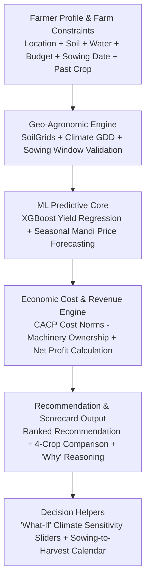

# 🌾 01. Ideation & Core Project Philosophy
### Project Name: **AGRI-DECIDE**
### Official Problem Statement: **AI-Based Crop Recommendation for Farmers (PS #24)**

---

## 1. Problem Statement Deconstruction

### What the Problem Actually Is:
The conventional approach to "AI Crop Recommendation" is fundamentally flawed. 95% of student projects download a static Kaggle dataset, ask farmers to type chemical numbers (N=40, P=50, K=50, pH=6.5) that no smallholder farmer knows, and output a single text string like *"Grow Rice!"*.

**In real Indian agriculture, a practical crop recommendation system must solve 5 real-world constraints:**
1. **Soil & Climate Reality:** Matching regional soil texture and historical agro-climatic conditions without requiring chemical lab kits.
2. **Water Availability & Irrigation Source:** Differentiating between perennial canal irrigation, a 300ft borewell, an open well, or a rainfed farm.
3. **Sowing Window & Date Impact:** Sowing on 20th June vs. 15th July completely changes yield potential, pest risk, and harvest timing.
4. **Farmer Financial Capital & Machinery:** Recommending a crop that fits the farmer's available budget, and accurately adjusting costs based on whether the farmer owns machinery (tractor/sprayer) or must rent.
5. **Explainability ("Why this crop?"):** Giving clear, understandable reasons why Crop A ranks higher than Crop B, instead of a mysterious black-box output.

---

## 2. Clarifying Regional Crop Clustering & Market Reality

* **Regional Specialization is Normal:** Farmers in a taluka often grow the same crop (e.g. Nashik in Onion, Jalgaon in Banana, Malwa in Soybean). This creates **local market efficiency** (specialized APMC mandis, labor availability, seed supply, and bulk buyers).
* **Our System Does NOT Force Crop Displacement:** We do not artificially force farmers to plant uncommon crops. 
* **Informative Market Volatility Tagging:** We provide historical seasonal price bands and flag **Price Volatility** purely as an informational risk note (e.g. *Price Volatility: Moderate based on historical October arrivals*), empowering farmers with realistic income expectations.

---

## 3. The Core Architecture & Innovations



### 1. Zero-Friction Geo-Agronomics
* The farmer selects their district/taluka (or drops a GPS pin). The backend automatically pulls baseline soil characteristics and agro-climatic data from public GIS benchmarks (SoilGrids / ICAR Soil Survey).

### 2. Sowing Date Window Validation
* Evaluates the farmer's planned sowing date against the regional optimal window and flags whether it is **🟢 Optimal**, **🟡 Late (Yield Penalty)**, or **🔴 Closed**.

### 3. Machine Learning Yield Prediction
* An `XGBoost` regression model trained on 10 years of district-level historical data that predicts expected yield (in quintals/acre) factoring in soil type and sowing date delay.

### 4. Realistic Economic Cost & Net Income Engine
* Uses official **Ministry of Agriculture CACP (Commission for Agricultural Costs & Prices)** state-wise cultivation cost norms. Adjusts costs if the farmer owns a tractor/sprayer vs. renting.
* Calculates **Net Profit per Acre** = $(\text{Predicted Yield} \times \text{Expected Mandi Price}) - \text{Adjusted Cultivation Cost}$.

### 5. Multi-Crop Comparison Scorecard with Explainable Reasoning
* Instead of one opaque recommendation, provides a side-by-side comparison of the top candidate crops with clear bullet points explaining *why* the #1 crop was chosen.

### 6. Interactive "What-If" Sensitivity Simulator
* Allows evaluators and farmers to test climate and market shocks via sliders:
  * *"What if sowing is delayed by 15 days?"* $\rightarrow$ Model shows yield and profit impact.
  * *"What if rainfall is 20% lower?"* $\rightarrow$ Model re-ranks drought-resilient crops.

---

## 4. Chosen Technology Stack

```
┌────────────────────────────────────────────────────────────────────────────────────────┐
│                                   PRODUCTION TECH STACK                                │
├────────────────────┬─────────────────────────────┬─────────────────────────────────────┤
│ Layer              │ Technology                  │ Key Benefit                         │
├────────────────────┼─────────────────────────────┼─────────────────────────────────────┤
│ **Frontend UI**    │ React / Next.js + Tailwind  │ Fast PWA, mobile-first responsive,  │
│                    │ + Lucide Icons              │ high-contrast GIGW compliance.      │
├────────────────────┼─────────────────────────────┼─────────────────────────────────────┤
│ **Backend API**    │ Python 3.11 + FastAPI       │ Asynchronous, high-performance,     │
│                    │                             │ native support for scikit-learn/ML. │
├────────────────────┼─────────────────────────────┼─────────────────────────────────────┤
│ **Database**       │ PostgreSQL                  │ Relational integrity, structured    │
│                    │                             │ storage of CACP costs and mandis.   │
├────────────────────┼─────────────────────────────┼─────────────────────────────────────┤
│ **Machine Learning**│ `scikit-learn` / `XGBoost`  │ Yield prediction regression with    │
│                    │                             │ clear RMSE and R² accuracy metrics. │
├────────────────────┼─────────────────────────────┼─────────────────────────────────────┤
│ **Price Forecast** │ `LightGBM` / Seasonal Stats │ Harvest-month wholesale price band  │
│                    │                             │ projections from Agmarknet data.    │
├────────────────────┼─────────────────────────────┼─────────────────────────────────────┤
│ **Voice / Audio**  │ Web Speech API (Browser)    │ Marathi/Hindi voice input and       │
│                    │                             │ text-to-speech audio playback.      │
└────────────────────┴─────────────────────────────┴─────────────────────────────────────┘
```
