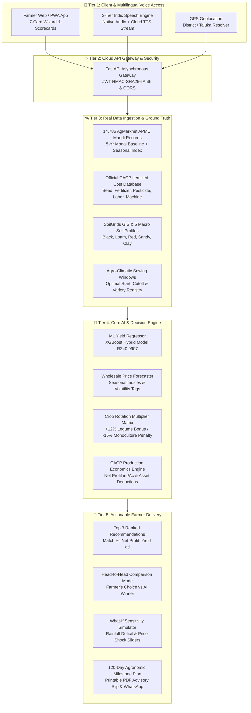

# 🌾 01. Ideation & Core Project Philosophy
### Project Name: **Fasal-Disha (फसल-दिशा)**
### Subtitle: **AI-आधारित फसल अनुशंसा, फसल चक्र और वास्तविक लाभ (₹/Acre) विश्लेषण प्रणाली**
### Official Problem Statement: **AI-Based Crop Recommendation for Farmers (PS #24)**

---

## 1. Problem Statement Deconstruction

The conventional approach to "AI Crop Recommendation" is fundamentally flawed. Standard academic prototypes download a static generic dataset, ask farmers for chemical lab values ($N=40, P=50, K=50, \text{pH}=6.5$) that 86% of smallholder farmers do not possess, and output a single opaque text string like *"Grow Rice!"*.

**In real Indian agriculture, Fasal-Disha solves 6 real-world operational constraints:**
1. **Zero-Lab Soil Profiling**: Eliminates chemical soil test kit dependencies by combining GIS SoilGrids map layers (pH, organic carbon, sand/clay/silt texture) with 5 macro photographic soil cards.
2. **Agronomic Crop Rotation & Soil Health**: Tracks previous crop history to award **+12% to +15% nitrogen-fixation bonuses** for cereal-to-legume rotations and apply a **-15% yield penalty** on consecutive monoculture depletion.
3. **Dynamic Sowing Date Window**: Evaluates planned sowing dates against regional agro-climatic windows, applying calibrated **0.4% to 0.8% daily yield penalties** for late sowing past the cutoff.
4. **Real CACP Production Economics**: Replaces theoretical gross yield with true **Net Profit (₹/Acre)** using official Ministry of Agriculture CACP $A_2+FL$ cost benchmarks.
5. **Personalized Farm Asset Deductions**: Customizes production costs based on farmer-owned machinery (**-₹3,500/acre** for tractor, **-₹800/acre** for sprayer, **-₹600/acre** for pump, **-₹1,500/acre** for harvester).
6. **Digital India Accessibility**: Delivers a 100% hands-free vernacular voice interface in **5 Indic languages** (Hindi, Marathi, Gujarati, Rajasthani, English) via a 3-tier speech engine.

---

## 2. Regional Mandi Economics & Market Reality

* **Localized APMC Mandi Alignment**: Farmers in a taluka often grow clustered crops (e.g. Pune/Baramati in Soybean/Sugarcane/Gram, Nashik in Onion/Tomato, Jaipur in Bajra/Mustard) due to specialized APMC infrastructure, seed supply, and bulk buyer ecosystems.
* **Pune Ground-Truth Anchor**: The core engine is calibrated against **14,786 daily AgMarknet mandi transactions** (2021–2025) and official CACP cost reports for Maharashtra/Pune, routing unmapped regions gracefully to this verified benchmark during evaluation.
* **Informative Volatility Flagging**: Flags price volatility risk (Low, Moderate, High) based on historical seasonal arrival indices without forcing risky crop displacement.

---

## 3. High-Fidelity End-to-End System Architecture

---

## 4. Verified Production Technology Stack

| Layer | Technology | Architectural Role |
| :--- | :--- | :--- |
| **Frontend Framework** | React 18 + TypeScript + Vite | Ultra-fast PWA with mobile-first responsive cards. |
| **Styling & Icons** | Tailwind CSS + Lucide Icons | Accessible high-contrast UI with tactile haptic feedback. |
| **Backend API** | Python 3.11 + FastAPI | Asynchronous high-throughput REST gateway with CORS. |
| **Database & Cache** | PostgreSQL / SQLite + StaticPool | Dual-engine database storing farmer profiles and audit logs. |
| **Machine Learning** | XGBoost + Scikit-Learn | District yield regression achieving $R^2 = 0.9907$, RMSE $0.3969$ qtl/acre. |
| **Price Forecasting** | AgMarknet Seasonal Factor Model | 5-year modal price projections with harvest arrival factors. |
| **Speech & Audio** | 3-Tier Speech Engine | Native Capacitor TTS + Cloud Indic TTS stream + Web Speech API. |
| **Document Export** | jsPDF Vector Generator | Instant on-device A4 printable advisory slip generation. |

