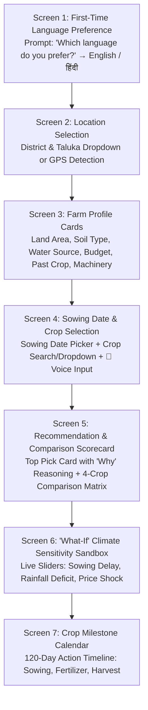

# 🧭 02. Streamlined User Flow & Application Journey
### System: **AGRI-DECIDE — AI Crop Recommendation Engine (PS #24)**

---

## 1. End-to-End Flow Overview



---

## 2. Detailed Screen-by-Screen Journey

---

### 🌐 Screen 1: First-Time Language Preference & Location
* **First-Time Welcome Modal:**
  * Displays two large touch buttons:
    * `[ 🇬🇧 English ]`
    * `[ 🇮🇳 हिंदी (Hindi) ]`
* **Location Selection (after language is set):**
  * Option A: `📍 Use My GPS Location` (Auto-detects District & Taluka).
  * Option B: Clean Dropdowns (`State: Rajasthan / Maharashtra` $\rightarrow$ `District: Jaipur / Pune` $\rightarrow$ `Taluka`).
* **Next Action:** Button $\rightarrow$ `आगे बढ़ें / Continue to Farm Details`.

---

### 📋 Screen 2: Interactive Question Cards (Farm Profile)
A clean, card-based wizard with large visual tiles (in English or Hindi based on preference):
1. **Land Area (जमीन का क्षेत्रफल):** `[ 5.0 ]` Acres.
2. **Soil Type (मिट्टी का प्रकार):** 
   * `[⬛ Deep Black / काली मिट्टी]` | `[🟫 Medium Loam / दोमट मिट्टी]` | `[🟥 Red / लाल मिट्टी]` | `[🟨 Sandy / बलुई मिट्टी]`.
3. **Water Source & Availability (पानी का स्रोत व उपलब्धता):**
   * Source: `[🚰 Borewell / नलकूप]` | `[🌊 Open Well / कुआं]` | `[🏞️ Canal / नहर]` | `[🌧️ Rainfed / केवल वर्षा आधारित]`.
   * Capacity: `[💧 Low (1-2 irrigations)]` | `[💧💧 Medium (4-6)]` | `[💧💧💧 High (Perennial)]`.
4. **Available Working Capital (उपलब्ध बजट):** `₹80,000`.
5. **Previous Season Crop (पिछली फसल):** `[Wheat / गेहूं]` (Enables crop rotation bonus).
6. **Machinery Ownership (कृषि यंत्र):** `[x] Own Tractor` | `[x] Own Sprayer` (Adjusts machinery rental costs).

---

### 🌾 Screen 3: Sowing Date & Candidate Crop Selection
* **Planned Sowing Date (बुवाई की तारीख):** `📅 20th June 2027` (Quick buttons: `[Today]`, `[Next 7 Days]`).
* **Crop Selection Methods (Search + Dropdown + Voice):**
  1. **🔍 Search Bar & Dropdown Multi-Select:** Type or select from the regional crop list (Soybean, Maize, Tur, Cotton, Bajra, Mustard, Groundnut, etc.).
  2. **🎤 Voice Input Button:** A dedicated microphone button specifically for speaking the crops the farmer is considering:
     * *Farmer speaks:* *"सोयाबीन, मक्का, कपास और अरहर"*
     * *System automatically populates the candidate crop chips!*
  3. **Auto-Recommend Option:** Button $\rightarrow$ `[🌟 सर्वश्रेष्ठ फसलें सुझाएं / Auto-Recommend Best Crops]`.
* **Next Action:** Button $\rightarrow$ `फसल अनुशंसा देखें / Run AI Crop Recommendation`.

---

### 📊 Screen 4: Recommendation & 4-Crop Comparison Scorecard
The core decision screen:

#### 🏆 Top Recommended Crop Card:
* **Primary Recommendation:** `🌱 Soybean (JS-335) / सोयाबीन`
* **Key Numbers:**
  * Expected Yield: `9.5 Quintals/Acre` (Range: 8.5 – 10.5 qtl)
  * Total Input Cost: `₹24,500/Acre` (Adjusted for owned tractor)
  * Expected Mandi Price: `₹4,800/Quintal` (Projected for October harvest)
  * **Expected Net Profit:** `₹21,100 / Acre`
  * Duration: `95 Days` | **Profit per Day:** `₹222 / Day`
* **Explainability ("Why this crop is recommended / यह फसल क्यों चुनें?"):**
  * ✅ काली मिट्टी और खरीफ मौसम के साथ 92% अनुकूलता।
  * ✅ कुएं के पानी की मध्यम उपलब्धता 95 दिनों की फसल के लिए पर्याप्त है।
  * ✅ आपके ₹80,000 के बजट के पूर्णतः अनुकूल।
  * ✅ गेहूं के बाद दाल/तिलहन फसल चक्र (Crop Rotation) के लिए सर्वोत्तम।
* **Audio Voice Summary:** `🔊 सुनें (Listen to summary in Hindi/English)`.

#### 📋 4-Crop Comparison Matrix (Side-by-Side):
```
┌──────────────────┬──────────────┬──────────────┬──────────────┬──────────────┐
│ Metric           │ 🌱 Soybean   │ 🌾 Maize     │ 🌿 Tur/Arhar │ 🪴 Cotton    │
├──────────────────┼──────────────┼──────────────┼──────────────┼──────────────┤
│ Agronomic Fit    │ 92% 🟢       │ 84% 🟢       │ 88% 🟢       │ 75% 🟡       │
│ Sowing Window    │ Optimal 🟢   │ Optimal 🟢   │ Optimal 🟢   │ Late 🟡      │
│ Total Input Cost │ ₹24,500/acre │ ₹22,000/acre │ ₹20,000/acre │ ₹36,000/acre │
│ Expected Yield   │ 9.5 qtl/acre │ 24.0 qtl/acre│ 6.5 qtl/acre │ 7.8 qtl/acre │
│ Harvest Price    │ ₹4,800/qtl   │ ₹2,150/qtl   │ ₹7,200/qtl   │ ₹6,400/qtl   │
│ Net Profit / Acre│ ₹21,100/acre │ ₹29,600/acre │ ₹26,800/acre │ ₹13,920/acre │
│ Duration (Days)  │ 95 Days      │ 105 Days     │ 180 Days     │ 160 Days     │
├──────────────────┼──────────────┼──────────────┼──────────────┼──────────────┤
│ 🏆 Net ₹ / Day   │ ₹222 / Day   │ ₹281 / Day   │ ₹148 / Day   │ ₹87 / Day    │
└──────────────────┴──────────────┴──────────────┴──────────────┴──────────────┘
```

---

### 🎛️ Screen 5: "What-If" Sensitivity Sandbox (For Evaluators & Farmers)
Interactive sliders to demonstrate dynamic AI adaptation:
* **Slider 1: Sowing Date Delay (बुवाई में देरी: 0 से 30 दिन)**
  * *Drag to +20 Days:* Watch Cotton yield drop sharply (-25%) due to shortened boll-filling window, while short-duration Soybean and Moong remain resilient.
* **Slider 2: Rainfall Deficit (बारिश की कमी: 0% से -40%)**
  * *Drag to -30%:* Watch the system boost drought-tolerant Pulses (Tur/Moong) over high-water crops.
* **Slider 3: Mandi Price Fluctuation (बाजार भाव में उतार-चढ़ाव: -25% से +25%)**

---

### 📅 Screen 6: Crop Milestone Calendar
An actionable 120-day timeline for the recommended crop:
* **Day 0 (20 June):** Sowing & Trichoderma Seed Treatment (बुवाई व बीज उपचार).
* **Day 21 (11 July):** First Weeding & Fertilizer Top-Dress (पहली निराई-गुड़ाई व खाद).
* **Day 45 (04 August):** Pod Initiation Stage — Water check (फलियां बनने की अवस्था - सिंचाई जांच).
* **Day 80 (08 September):** Pre-Harvest Inspection & Mandi Price Tracking (कटाई पूर्व निरीक्षण).
* **Day 95 (23 September):** Optimal Harvest Window (कटाई का सही समय).
