# 🧭 02. Streamlined User Flow & Application Journey
### System: **Fasal-Disha (फसल-दिशा) — Intelligent Multilingual Crop Advisory Engine**

---

## 1. End-to-End User Flow Architecture

```mermaid
flowchart TD
    L1[🌐 Screen 1: Regional Language Selection\n5 Languages: हिन्दी, मराठी, ગુજરાતી, राजस्थानी, English\nNative Audio Pronunciation & Voice Search] --> L2[✅ Screen 2: Language Confirmation\nVisual native glyph card with welcome audio]
    L2 --> L3[🔊 Screen 3: Interactive Audio Guide\nSpeaker verification & volume check tutorial]
    L3 --> L4[🔐 Screen 4: Passwordless Mobile Login\n10-digit phone + 6-digit OTP verification]
    L4 --> H1[🏠 Screen 5: Farmer Dashboard Home Hub\nGreeting, recent advisory summary & primary CTA]
    
    subgraph WIZARD ["🚜 7-Card Guided Question Wizard"]
        W1[Card 1: Farm Size & Units\nKeypad + Acre / Bigha / Guntha Live Conversion]
        W2[Card 2: Soil Type Selection\n5 Photographic Soil Profiles with Moisture Badges]
        W3[Card 3: Water Availability\nHigh Canal / Medium Well / Rainfed Dryland]
        W4[Card 4: Owned Farm Equipment\nTractor -₹3500 / Sprayer -₹800 / Pump -₹600]
        W5[Card 5: Previous Crop History\nCrop grid + speech-to-text voice chip input]
        W6[Card 6: Sowing Timing\nThis Week +3d / Next Month +25d / Custom Calendar]
        W7[Card 7: Intended Farmer Crop\nCaptures farmer's initial choice for 🆚 comparison]
        
        W1 --> W2 --> W3 --> W4 --> W5 --> W6 --> W7
    end
    
    H1 --> W1
    
    W7 --> R1[📊 Screen 6: Recommendations & Scorecard\nTop Choice Hero + Head-to-Head 🆚 Card\nNet Profit ₹, Yield qtl, CACP Itemized Cost Breakdown]
    R1 --> R2[🎛️ Screen 7: Weather & Risk Simulation Sandbox\nLive Sliders: Rainfall Deficit -35% to +25% & Mandi Price Shock]
    R2 --> R3[📅 Screen 8: 120-Day Milestone Action Plan & Advisory Slip\nVoice-enabled stage timeline + PDF Download + WhatsApp Sharing]
    R3 --> H1
```

---

## 2. Detailed Screen-by-Screen Journey

---

### 🌐 Screen 1: Regional Language Selection (`LanguageSelectionPage.tsx`)
* **5 Primary Agricultural Languages**:
  * `[ 🇮🇳 हिन्दी (Hindi) ]`
  * `[ 🇬🇧 English ]`
  * `[ 🌾 मराठी (Marathi) ]`
  * `[ 🌻 ગુજરાતી (Gujarati) ]`
  * `[ 🏜️ राजस्थानी (Rajasthani) ]`
* **Interactive Features**:
  * Tap any language to trigger instant native audio voice pronunciation and haptic vibration.
  * Audio guide button `[ 🔊 सुनें ]` on the header for zero-literacy audio assistance.
  * Selection directly moves to the confirmation screen.

---

### ✅ Screen 2: Language Confirmation (`LanguageConfirmPage.tsx`)
* **Visual Confirmation Card**:
  * Displays the selected language with its native flag/icon.
  * Automatic voice prompt in the selected language welcoming the farmer.
* **Actions**:
  * `[ ✓ आगे बढ़ें / Continue ]` $\rightarrow$ Enters Dashboard Home.
  * `[ ↩️ भाषा बदलें / Change Language ]` $\rightarrow$ Returns to selection.

---

### 🏠 Screen 3: Farmer Dashboard Home Hub (`HomePage.tsx`)
* **Location & Top Bar**:
  * Automatic GPS / Taluka detection with manual switcher (`📍 जयपुर, राजस्थान` / `📍 पुणे, महाराष्ट्र`).
  * Live online status badge and quick language modal toggle.
* **Real-time Live Widgets**:
  * ⛅ **Local Weather Widget**: Current temperature, humidity, and rainfall forecast.
  * 📈 **Live Mandi Price Ticker**: Real-time mandi prices for regional Kharif/Rabi crops.
* **Primary Decision CTA**:
  * Large touch card: **`🌾 नई फसल सलाह शुरू करें (Start AI Crop Advisory)`** $\rightarrow$ Launches Wizard.
* **Persistent Bottom Navigation**:
  * `[ 🏠 होम (Home) ]` | `[ 📅 मेरी फसल (My Crop) ]` | `[ 📜 इतिहास (History) ]` | `[ ⚙️ सेटिंग्स (Settings) ]`.

---

### 🚜 Screen 4: 5-Card Focused Question Wizard (`WizardPage.tsx`)

Every question is presented on an isolated single-concept card with a top 5-step progress pill, top-aligned `[ 🔊 सुनें ]` audio narration, and docked bottom navigation (`← पीछे जाएं` / `आगे बढ़ें →`):

#### 1️⃣ Card 1: Farm Size (`FarmSizeCard.tsx`)
* Numeric touch keypad for entering land area.
* Regional unit toggle pills (`एकड़ (Acre)`, `बीघा (Bigha)`, `गुंठा (Guntha)`).
* Live mathematical conversion badge (e.g., *"3.0 बीघा = 1.88 एकड़"*).

#### 2️⃣ Card 2: Soil Type (`SoilTypeCard.tsx`)
* **5 Authentic Macro DSLR Farm Soil Photos**:
  1. **काली मिट्टी (Black Cotton Soil)**: Heavy clay Regur soil with high moisture retention.
  2. **दोमट मिट्टी (Alluvial Loam Soil)**: Crumbly organic-rich balanced soil.
  3. **लाल मिट्टी (Red Laterite Soil)**: Porous, iron-rich well-drained soil.
  4. **बलुई / रेतीली मिट्टी (Sandy Soil)**: Desert sand granules with fast drainage.
  5. **मटियार / चिकनी मिट्टी (Clayey Soil)**: Heavy density water-holding soil.
* **Physical Property Badge**: Clean moisture capacity pill (`[ 💧 नमी धारण: उच्च / मध्यम / कम ]`).

#### 3️⃣ Card 3: Water Availability (`WaterSourceCard.tsx`)
* **भरपूर पानी (High Irrigation)**: नहर या बारहमासी ट्यूबवेल (All crop types compatible).
* **मध्यम पानी (Medium Irrigation)**: कुआं या सीमित ट्यूबवेल (2-3 irrigations).
* **कम पानी / वर्षा आधारित (Rainfed)**: केवल मानसूनी बारिश पर निर्भर (Drought-resilient crops).

#### 4️⃣ Card 4: Previous Crop Rotation (`PreviousCropCard.tsx`)
* Clean 2-column typography selection grid without generic icons:
  * `[ गेहूं ]`, `[ चना ]`, `[ धान ]`, `[ सोयाबीन ]`, `[ कपास ]`, `[ मक्का ]`, `[ बाजरा ]`, `[ अन्य / खाली ]`.
* Dedicated **🎤 Voice Input**: Farmer speaks their previous crop names for automated chip selection.

#### 5️⃣ Card 5: Sowing Timing (`SowingSeasonCard.tsx`)
* ⚡ **इसी हफ्ते (अगले ७ दिनों में)**: Immediate sowing with weather forecast alignment.
* 🌧️ **अगले एक महीने में**: Planned seasonal monsoon timing.
* 📅 **निश्चित तारीख चुनें**: Seamless integrated calendar input bar without nested boxes.

---

### 📊 Screen 5: AI Recommendation & Interactive Candidate Scorecards (`RecommendationsStep.tsx`)

#### 🏆 Active Selected Crop Hero Card:
* **Top Header Banner**: `★ सर्वोत्तम फसल विकल्प (94% मैच स्कोर)` or `चयनित फसल विवरण (88% मैच स्कोर)`.
* **3-Pillar Balanced Scorecard** (Disciplined neutral stone palette with forest emerald profit highlight):
  1. **अनुमानित शुद्ध लाभ (Net Profit)**: `₹24,525 / एकड़` (Primary metric).
  2. **अनुमानित पैदावार (Expected Yield)**: `9.5 क्विंटल / एकड़`.
  3. **अनुमानित लागत (Working Cost)**: `₹19,412 / एकड़`.
* **CACP Itemized Cost Breakdown Accordion (A2)**:
  * Seed cost (`बीज लागत`), Fertilizer (`उर्वरक/खाद`), Pesticide (`कीटनाशक`), Machinery rental (`कृषि यंत्र`), Labour (`मजदूरी`), Irrigation (`सिंचाई`).
* **AI Explainability ("चयन का कारण")**:
  * 4 tailored bullet points explaining soil suitability, water compatibility, profit margin, and crop rotation benefits.

#### 📋 Interactive Candidate Crop Selection:
* Displays all regional candidate crops (**सोयाबीन**, **मक्का**, **बाजरा**, **मूंगफली**).
* **Instant Dynamic Switch**: Clicking **ANY** candidate crop immediately updates the main hero card to display that crop's full 3-pillar metrics, CACP cost breakdown, and AI rationale!

#### 🚀 Primary Action:
* Floating action bar docked at `bottom-16` with progressive backdrop blur:
  `[ {चयनित फसल} के साथ मौसम व जोखिम जांचें → ]`.

---

### 🎛️ Screen 6: Weather & Risk Simulation Sandbox (`WhatIfStep.tsx`)
* **Interactive Live Sliders**:
  1. **बारिश में बदलाव (-35% से +25%)**: Simulates drought stress vs. abundant monsoon rainfall.
  2. **मंडी भाव में उतार-चढ़ाव (-25% से +25%)**: Simulates market price crashes vs. harvest price rallies.
* **Real-time Modified Outcomes**:
  * Live adjusted yield (`संशोधित पैदावार: X क्विंटल`) and net profit (`संशोधित शुद्ध लाभ: ₹X`).
  * AI Risk Guidance callout explaining crop stability under climate/market stress.
* **Next Action**: Button $\rightarrow$ `[ कृषि कार्य-योजना देखें / View 120-Day Action Plan ]`.

---

### 📅 Screen 7: 120-Day Milestone Action Plan & Advisory Slip (`MilestoneCalendarStep.tsx`)
* **Stage-by-Stage Agronomic Timeline**:
  * **दिन 0**: राइजोबियम व ट्राइकोडर्मा से बीज उपचार एवं बुवाई.
  * **दिन 21**: पहली निराई-गुड़ाई एवं खरपतवार नियंत्रण.
  * **दिन 45**: फूल आने की अवस्था एवं फेरोमोन ट्रैप कीट निगरानी.
  * **दिन 75**: दाना भराव अवस्था एवं घुलनशील उर्वरक पोषण प्रबंधन.
  * **दिन 95**: फसल कटाई, धूप में सुखाना एवं 12% नमी पर सुरक्षित भंडारण.
* **Interactive Features**:
  * 🔊 Voice audio readout for every individual farming stage.
  * ☑️ Completion checkboxes to track farm activities.
* **Export & Sharing Actions**:
  * 📥 **[ 📄 पीडीएफ सलाह पर्ची डाउनलोड करें (Download Advisory Slip) ]**: Generates clean printable A4 PDF advisory slip (`PrintableAdvisorySlip.tsx`).
  * 💬 **[ 📱 व्हाट्सएप पर साझा करें (Share to WhatsApp) ]**: Sends structured advisory summary directly to farmer WhatsApp groups.

