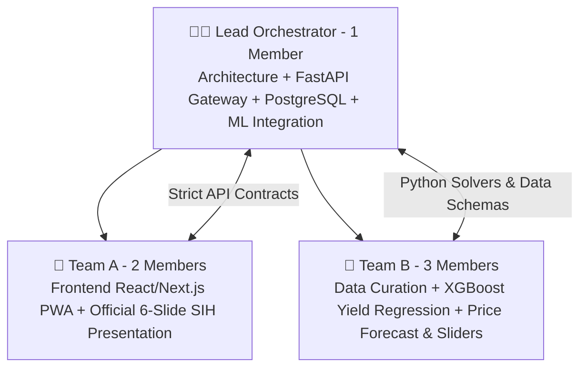

# 👥 04. Team Orchestration & 7-Day Sprint Master Plan
### Project: **AGRI-DECIDE — AI Crop Recommendation Engine (PS #24)**

---

## 1. Team Division & Responsibility Matrix (6 Members)



---

### 1. Lead Orchestrator & Backend Lead (You — 1 Member)
* **Core Responsibilities:**
  * Build the **FastAPI Backend Gateway** with all 5 core REST endpoints.
  * Design and migrate the **PostgreSQL Database** (`farmers`, `farms`, `crops`, `crop_costs_cacp`, `mandi_prices_historical`, `district_sowing_windows`).
  * Integrate the ML yield models and price forecasting modules built by Team B.
  * Deploy the application to a live public URL (Render / Railway / Vercel).

---

### 2. Team A — Frontend UI & Pitch PPT (2 Members)
* **Core Responsibilities:**
  * **Frontend Development:** Build the 6 user flow screens in React/Next.js using Tailwind CSS and the `PERMITTED_ACTIONS` contract.
  * **Accessibility & Usability:** Implement the Marathi/Hindi language toggle, large touch cards, and audio playback.
  * **Official 6-Slide Presentation:** Build the official SIH pitch deck (PDF) strictly following the 6-slide limit.
  * **Demo Recording:** Record a high-definition offline backup screen recording of the demo.

---

### 3. Team B — AI/ML & Data Engine (3 Members)
* **Member 1 (Data Curation & Baseline Norms):**
  * Curate clean CACP cultivation costs, Agmarknet 5-year historical prices, and ICAR sowing windows for 15 core crops in 1 target district (e.g. Pune/Baramati).
* **Member 2 (Predictive Yield ML):**
  * Train and benchmark the **XGBoost Yield Regression Model** on district historical data, computing official **RMSE and $R^2$ metrics**.
* **Member 3 (Price Forecast & What-If Engine):**
  * Implement the harvest-month price forecasting logic and the real-time "What-If" sensitivity simulator.

---

## 2. 7-Day Sprint Timeline

```
DAY 1 (Setup, Contracts & Data Curation)
├── Lead: Setup Git repo, lock API contracts, initialize PostgreSQL.
├── Team A: Setup Next.js boilerplate, build Screen 1 & Screen 2 layouts.
└── Team B: Curate CACP costs and Agmarknet prices for 15 crops in target district.

DAY 2 (Database Seeding & ML Training)
├── Lead: Build FastAPI models, schemas, and database seed scripts.
├── Team A: Build Screen 3 (Sowing Date & Crop Mode) and Screen 4 (Comparison Matrix).
└── Team B: Train XGBoost Yield Regressor; compute and record RMSE metrics.

DAY 3 (Core Recommendation Integration)
├── Lead: Implement `POST /api/v1/crop/recommend` integrating ML yield and CACP costs.
├── Team A: Connect frontend to backend recommendation endpoint; verify data display.
└── Team B: Implement harvest-month price band projection logic.

DAY 4 (What-If Simulator & Milestones)
├── Lead: Implement `POST /api/v1/crop/what-if-simulate` and calendar endpoint.
├── Team A: Build Screen 5 (What-If Sliders) and Screen 6 (120-Day Action Timeline).
└── Team B: Test What-If slider logic with realistic climate shock inputs.

DAY 5 (Audio Voice-Over & Polish)
├── Lead: Integrate browser Web Speech API for Marathi/Hindi audio synthesis.
├── Team A: Add loading skeletons, polish responsive mobile layout, test edge cases.
└── Team B: Generate model evaluation charts (Actual vs Predicted Yield) for PPT.

DAY 6 (Cloud Deployment & Video Backup)
├── Lead: Deploy Backend (Render/Railway) + Database.
├── Team A: Deploy Frontend (Vercel) to custom live URL + Record 1080p demo video.
└── Team B: Finalize technical data slide for the presentation.

DAY 7 (Pitch Rehearsal & Defense Prep)
├── All 6 Members: Rehearse the 5-minute presentation script (each member speaks 45-60s).
├── Team A: Finalize official 6-slide SIH PDF deck.
└── Lead: Run full verification checklist ensuring ZERO hardcoded mock errors.
```
