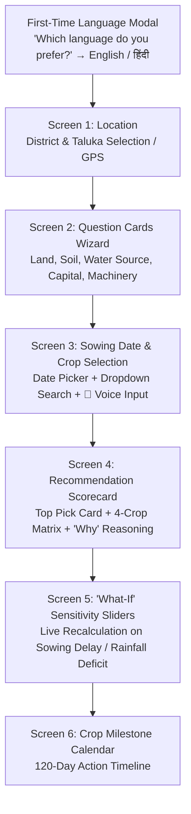

# 🎨 05. Frontend & Pitch Presentation Master Guide
### Assigned to: **Team A (2 Members)**
### Project: **AGRI-DECIDE — AI Crop Recommendation Engine (PS #24)**

---

## Part 1: Frontend Guidelines & Usability

> **Design Motto:** *"Simple Outside, Intelligent Inside."*
> You have full creative liberty over visual styling, color palettes, card layouts, and typography. Follow these core usability directives:



### 1. Language & Voice Directives:
* **First-Time Language Selection:**
  * When a farmer opens the app for the first time, present a clean prompt modal:
    * `[ 🇬🇧 English ]`
    * `[ 🇮🇳 हिंदी (Hindi) ]`
  * Support **ONLY English and Hindi** for this initial release.
* **Voice Input Placement (Screen 3):**
  * Do NOT place voice on the main home screen as a confusing chatbot.
  * Place the **`🎤 बोलकर फसलें बताएं (Speak Crop Names)`** button specifically on **Screen 3** where the farmer lists/selects crops they are thinking of (e.g., *"बाजरा, मूंग, मूंगफली"*).
  * Pair this with a clean **Search Bar & Dropdown Multi-Select** for manual selection.

### 2. Farmer Usability Principles:
* **Large Touch Targets ($>48\text{px}$):** Easy to tap on budget smartphones.
* **Universal Icons:** 💧 for water, 🚜 for tractor, ⬛ for black soil.
* **Audio Voice-Over:** Trigger `window.speechSynthesis` on the `🔊 सुनें (Listen)` button to read recommendations aloud in Hindi/English.

---

## Part 2: Official 6-Slide SIH Presentation Deck Structure

```
┌────────────────────────────────────────────────────────────────────────────────────────┐
│                              THE OFFICIAL 6-SLIDE PPT BLUEPRINT                        │
├───────┬───────────────────────────────┬────────────────────────────────────────────────┤
│ Slide │ Title                         │ Key Visuals & Talking Points                   │
├───────┼───────────────────────────────┼────────────────────────────────────────────────┤
│ **1** │ Title, Theme & Team Identity  │ Project Name (AGRI-DECIDE), PS #24 (AI Crop    │
│       │                               │ Recommendation), Team Members, MNIT Logo.      │
├───────┼───────────────────────────────┼────────────────────────────────────────────────┤
│ **2** │ The Real Problem in Agri Apps │ Why Kaggle NPK apps fail: Sowing date delay,   │
│       │                               │ water availability mismatch, metric blindness. │
├───────┼───────────────────────────────┼────────────────────────────────────────────────┤
│ **3** │ Proposed Architecture & Sol.  │ System Diagram (Geo-Agronomics → Sowing Date → │
│       │                               │ ML Yield → CACP Cost → ₹/Day Recommendation).  │
├───────┼───────────────────────────────┼────────────────────────────────────────────────┤
│ **4** │ Technical Feasibility & ML    │ 100% Real Datasets (CACP, Agmarknet, SoilGrids)│
│       │                               │ XGBoost Yield Regressor RMSE & R² metrics.     │
├───────┼───────────────────────────────┼────────────────────────────────────────────────┤
│ **5** │ Economic Impact & Explainable │ Net Realization / Day, 'Why' Reasoning, Cost   │
│       │ Decision Making               │ Adjustment for Machinery, What-If Sensitivity. │
├───────┼───────────────────────────────┼────────────────────────────────────────────────┤
│ **6** │ Live Prototype & Future Scope │ Live Cloud URL, GitHub QR Code, 1080p Video    │
│       │                               │ Backup, Future Roadmap.                        │
└───────┴───────────────────────────────┴────────────────────────────────────────────────┘
```

---

## Part 3: 5-Minute Pitch Script

| Time | Presenter | Key Talking Points |
| :--- | :--- | :--- |
| **0:00 - 0:45** | Speaker 1 | *"Respected Jury, most crop recommendation apps ask farmers for chemical N-P-K numbers and predict a single crop. But small farmers need to know: **What will it cost me, what is my sowing window, and what is my net profit per day?** We present **AGRI-DECIDE**, an AI-Based Crop Recommendation Engine built on real agricultural ground realities."* |
| **0:45 - 1:30** | Speaker 2 | *"Our architecture uses **100% real government datasets** (CACP cultivation costs, Agmarknet historical mandi trends, SoilGrids). We evaluate **Sowing Window Delays**, predict yield with **XGBoost**, and adjust costs based on farmer-owned machinery."* |
| **1:30 - 3:30** | Both (Live Demo) | **1.** Show first-time Hindi selection $\rightarrow$ 6-card farmer input wizard.<br>**2.** On Screen 3, tap the **Voice button** and speak *"बाजरा, मूंग, मूंगफली"* to auto-populate crops.<br>**3.** Show Top Recommended Crop with clear bullet points on *why* it was chosen.<br>**4.** Show the 4-Crop Comparison Scorecard highlighting **Net Profit per Day ($₹/\text{Day}$)**.<br>**5.** Drag the **"What-If" Sowing Delay Slider (+15 days)** to show dynamic yield and profit adaptation live! |
| **3:30 - 4:15** | Speaker 1 | *"Our system respects regional agricultural specialization while providing farmers with actionable 120-day sowing-to-harvest milestones."* |
| **4:15 - 5:00** | All | *"Our stack is 100% FOSS, deployable on NIC Cloud with zero per-transaction API fees. We are open for questions."* |
