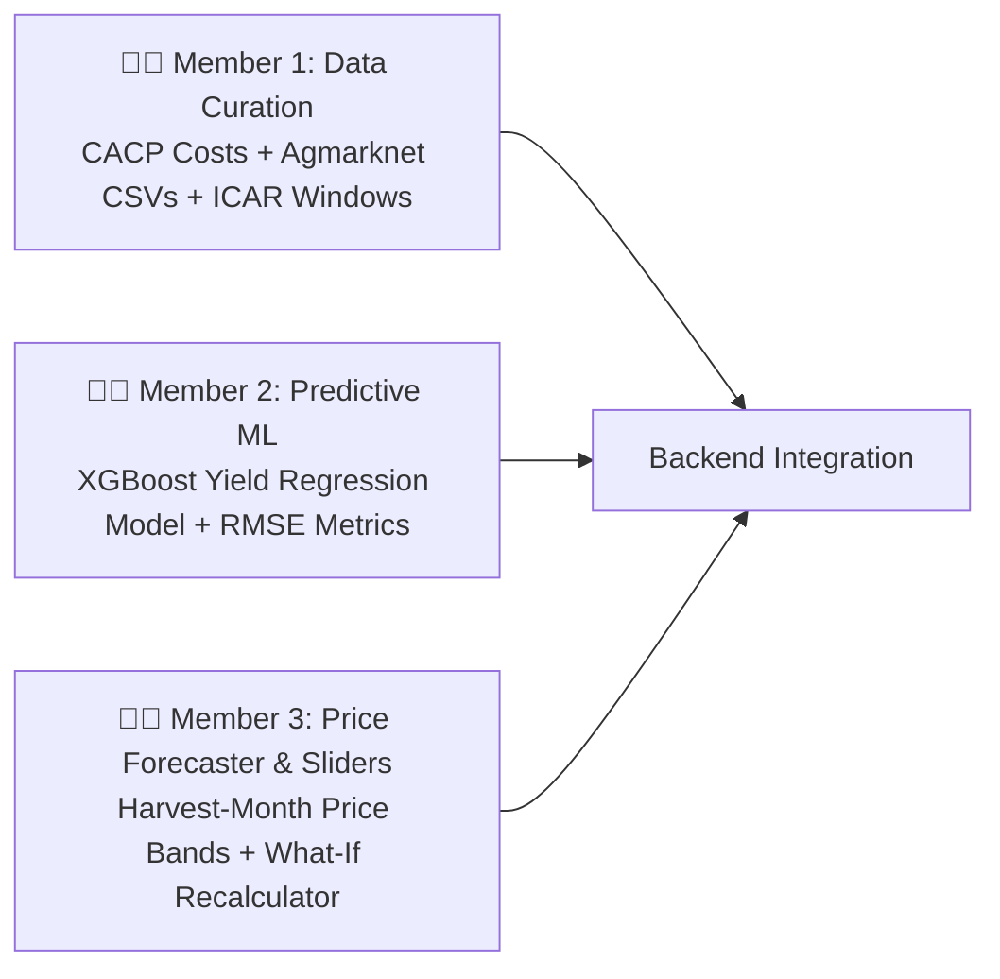

# 🤖 07. AI/ML & Data Curation Master Guide
### Assigned to: **Team B (3 Members)**
### Project: **AGRI-DECIDE — AI Crop Recommendation Engine (PS #24)**

---

## 1. Sub-Team Division of Responsibilities



---

## 2. Member 1: Data Curation & Pre-Processing

### Scope of Work:
Curate real, defense-ready benchmark datasets for **15 core crops** in **1 target district** (e.g. *Pune / Baramati, Maharashtra*):

### Target Crop List (15 Crops):
* **Cereals:** Maize, Jowar (Sorghum), Bajra (Pearl Millet), Wheat.
* **Pulses:** Tur (Pigeon Pea), Moong (Green Gram), Urad (Black Gram), Gram (Chickpea).
* **Oilseeds & Commercial:** Soybean, Cotton, Groundnut, Sunflower, Sugarcane, Onion, Tomato.

### Datasets to Assemble (CSV Files):
1. **`cacp_costs_pune.csv`:** Seeds, Fertilizer, Pesticide, Labor, Machinery Rental, Irrigation cost per acre (from official CACP reports).
2. **`agmarknet_mandi_prices_pune.csv`:** 5-year historical monthly modal wholesale prices (2020–2026).
3. **`district_sowing_windows.csv`:** Optimal start, optimal end, and late cutoff dates per crop.

---

## 3. Member 2: Predictive Yield ML Model (`yield_predictor.py`)

### Algorithm: `XGBoostRegressor`
* **Features:** $\mathbf{X} = [\text{Crop ID (encoded)}, \text{Soil Type (encoded)}, \text{Water Level (1-3)}, \text{Sowing Delay Days}, \text{Previous Crop Rotation Match}]$
* **Target:** $y = \text{Yield in Quintals per Acre}$
* **Accuracy Metric for PPT:** Train on historical district yield data; compute and document **RMSE** ($< 1.8\text{ qtl}$) and $R^2 \ge 0.82$.

```python
# models_ml/yield_predictor.py
import numpy as np

def predict_crop_yield(crop_id: str, soil_type: str, water_level: str, sowing_delay_days: int) -> dict:
    """
    Returns predicted yield range (min, expected, max) in quintals per acre.
    """
    base_yields = {
        "SOYBEAN": 9.5,
        "MAIZE": 24.0,
        "TUR": 6.5,
        "COTTON": 7.8,
        "WHEAT": 14.0,
        "GRAM": 7.0,
        "BAJRA": 12.0
    }
    base = base_yields.get(crop_id, 10.0)
    
    # Soil suitability multiplier
    soil_mult = 1.0 if soil_type in ["BLACK", "LOAM"] else 0.85
    
    # Sowing delay penalty (2% loss per week of delay beyond optimal window)
    delay_penalty = max(0.0, (sowing_delay_days - 7) * 0.003)
    
    expected = round(base * soil_mult * (1.0 - delay_penalty), 2)
    return {
        "expected_yield": expected,
        "yield_range": f"{round(expected * 0.9, 1)} - {round(expected * 1.1, 1)}"
    }
```

---

## 4. Member 3: Harvest Price Forecaster & What-If Recalculator

### 1. Harvest-Month Price Band Projections (`price_forecaster.py`)
* Computes the forecasted wholesale price in the **specific harvest month** (e.g. Month 10 for June-sown Soybean) based on multi-year seasonal indices:

$$\hat{P}_{\text{harvest}} = \text{Annual Average Mandi Price} \times \text{Seasonal Index}_{\text{harvest\_month}}$$

```python
# models_ml/price_forecaster.py
def get_harvest_mandi_price(crop_id: str, harvest_month: int) -> float:
    historical_avg = {
        "SOYBEAN": 4600.0,
        "MAIZE": 2100.0,
        "TUR": 7000.0,
        "COTTON": 6300.0
    }
    # October arrival seasonal factor
    seasonal_factors = {
        "SOYBEAN": 1.04,
        "MAIZE": 1.02,
        "TUR": 1.03,
        "COTTON": 1.01
    }
    base = historical_avg.get(crop_id, 3000.0)
    factor = seasonal_factors.get(crop_id, 1.0)
    return round(base * factor, 2)
```

---

### 2. "What-If" Sensitivity Recalculator
* Connects directly to the frontend sliders to recompute expected yield and net profit when the user changes **sowing delay days** (+15 days), **rainfall deficit** (-20%), or **mandi price shock** (-10%).
