# 🌾 फसल-दिशा (Fasal-Disha) — Precision AI Crop Recommendation & Net Profit Engine

> **हर खेत को मिले सही दिशा** — An enterprise-grade, multilingual agro-decision platform bridging **ISRIC SoilGrids 250m GIS data**, **14,780+ AgMarknet APMC Mandi trends**, official **CACP $A_2+FL$ production cost norms**, and **XGBoost predictive regression** to deliver ground-truth **Net Profit (₹/Acre)** optimization for Indian farmers.

[](https://sih.gov.in)
[](https://python.org)
[](https://fastapi.tiangolo.com)
[](https://reactjs.org/)
[](https://www.typescriptlang.org/)
[](https://xgboost.readthedocs.io/)
[](https://agmarknet.gov.in/)
[](https://capacitorjs.com/)
[](https://tailwindcss.com/)
[](https://opensource.org/licenses/MIT)

---

## 📌 1. System Overview

**Fasal-Disha (Agri-Decide)** addresses the critical limitations of conventional crop recommendation systems by eliminating dependency on inaccessible chemical soil test parameters ($N, P, K, \text{pH}$) and replacing theoretical yield outputs with localized, itemized **Net Profit (₹/Acre)** accounting.

### Key Architectural Pillars:
* **Zero-Lab Soil Profiling**: Unifies ISRIC SoilGrids 250m GIS raster data with 5 standardized visual soil profile cards.
* **CACP Production Economics**: Computes operational expenditure ($A_2+FL$) with machinery ownership credits.
* **Agronomic Soil Health**: Models biological nitrogen fixation and monoculture yield penalties.
* **Dynamic Sowing Windows**: Integrates ICAR agro-climatic calendars with late-sowing delay decay curves.
* **Head-to-Head Comparison**: Real-time differential profit comparison ($\Delta ₹/\text{Acre}$) between farmer-selected crops and AI-optimized recommendations.
* **What-If Sensitivity Simulation**: Real-time sandbox testing against rainfall deficits and wholesale mandi price crashes.
* **Multimodal Indic Voice Accessibility**: 3-tier speech engine supporting Hindi, Marathi, Gujarati, Rajasthani, and English.

---

## 🏛️ 2. System Architecture Diagram

```mermaid
graph TD
    subgraph ClientTier ["Client & Presentation Tier (Top Left)"]
        VoiceEngine["Indic Speech Subsystem\n[Capacitor TTS • Web Speech]"]
        MobileApp["Android Mobile App & PWA\n[React • TypeScript • Vite • Capacitor]"]
        PDFGen["Advisory Document Generator\n[jsPDF Vector Engine]"]
    end

    subgraph ExternalDataTier ["Government & Spatial Data Repositories (Top Right)"]
        SoilGrids["ISRIC SoilGrids 250m GIS\n[Spatial Soil Profiling]"]
        Agmarknet["AgMarknet APMC Mandi Data\n[14,786 Records]"]
        CACP["CACP Production Cost Norms\n[Itemized A2+FL Database]"]
        ICAR["ICAR / ICRISAT Panel\n[Agro Windows & Bounds]"]
    end

    subgraph BackendTier ["Application & Service Tier (FastAPI Engine - Middle Center)"]
        RecEngine["Recommendation Orchestrator"]
        TTSEngine["Indic Audio Stream Engine\n[Bhashini Bridge]"]
        AuthEngine["Authentication Service\n[JWT Session]"]
        EconEngine["CACP Economics Engine"]
        WindowEngine["Sowing Window Engine"]
        GeoEngine["Geo-Agronomics Engine"]
    end

    subgraph MLTier ["Machine Learning & Inference Tier (Bottom Left)"]
        SensitivityEngine["Sensitivity Simulator\n[What-If Stress Testing]"]
        YieldModel["Yield Regression Model\n[XGBoost Regressor]"]
        PriceModel["Mandi Price Model\n[Time-Series Seasonal Index]"]
    end

    subgraph PersistenceTier ["Persistence & Data Access Tier (Bottom Right)"]
        ORM["Database Access Layer\n[SQLAlchemy ORM]"]
        PostgreSQL[("Relational Database\n[PostgreSQL 16]")]
    end

    %% Client Internal
    VoiceEngine <-->|"Native Audio Bridge"| MobileApp
    MobileApp -->|"Vector Render"| PDFGen

    %% Client-to-Backend API Routes
    MobileApp -->|"POST /api/v1/crop/recommend"| RecEngine
    MobileApp -->|"POST /api/v1/crop/what-if-simulate"| SensitivityEngine
    MobileApp -->|"POST /api/v1/farm/assess-soil-weather"| GeoEngine
    MobileApp -->|"GET /api/v1/crop/local-crops"| GeoEngine
    MobileApp -->|"GET /api/v1/tts"| TTSEngine
    MobileApp -->|"POST /api/v1/auth/login"| AuthEngine

    %% Service Layer Internal Orchestration
    RecEngine -->|"Calculate Cost & Deductions"| EconEngine
    RecEngine -->|"Validate Sowing Delay"| WindowEngine
    RecEngine -->|"Discover Mandi Crops"| GeoEngine
    RecEngine -->|"Predict Yield (qtl/acre)"| YieldModel
    RecEngine -->|"Forecast Wholesale Price"| PriceModel

    %% ML Sensitivity Connections
    SensitivityEngine -->|"Simulate Stress Yield"| YieldModel
    SensitivityEngine -->|"Simulate Price Shock"| PriceModel
    SensitivityEngine -->|"Recalculate Net Profit"| EconEngine

    %% Persistence Layer Connections
    RecEngine -->|"Audit Log Recommendation"| ORM
    GeoEngine -->|"Query Farm Profile"| ORM
    AuthEngine -->|"Read / Write Farmer"| ORM
    ORM -->|"psycopg2 Pool"| PostgreSQL

    %% External Data Ingestion
    EconEngine <..|"A2+FL Cost Norms"| CACP
    PriceModel <..|"5-Yr Modal Rates"| Agmarknet
    GeoEngine <..|"250m Raster Layers"| SoilGrids
    WindowEngine <..|"Agro Sowing Windows"| ICAR
    YieldModel <..|"District Yield Panel"| ICAR
```

---

## 🔬 3. Mathematical Formulations & Objective Functions

### 3.1. Net Profit Objective Function
For any candidate crop $i \in C$, the expected Net Profit per acre $\Pi_i$ is computed as:

$$\Pi_i = \left( \hat{Y}_i \times \hat{P}_{i, \text{harvest}} \right) - \left( C_{i, \text{CACP } A_2+FL} - \sum_{k \in K} \delta_k \cdot \mathbb{I}_{\text{owned}}(k) \right)$$

$$\Pi_{\text{per\_day}, i} = \frac{\Pi_i}{\text{Crop Duration (Days)}_i}$$

$$\Delta \Pi = \Pi_{\text{AI\_Top}} - \Pi_{\text{Farmer\_Intended}}$$

* $\hat{Y}_i$: Expected harvest yield in quintals per acre ($\text{qtl/acre}$).
* $\hat{P}_{i, \text{harvest}}$: Forecasted wholesale mandi realization price ($\text{₹/qtl}$).
* $C_{i, \text{CACP } A_2+FL}$: Itemized input expenditure ($A_2$) + imputed family labor value ($FL$).
* $\delta_k$: Cost savings for owned equipment $k \in \{\text{Tractor: -₹3500}, \text{Sprayer: -₹800}, \text{Pump: -₹600}, \text{Harvester: -₹1500}\}$.
* $\mathbb{I}_{\text{owned}}(k)$: Binary indicator of machinery ownership.

---

### 3.2. Predictive Yield Regression ($\hat{Y}_i$)
Yield prediction combines gradient-boosted decision trees with agronomic adjustment factors:

$$\hat{Y}_i = f_{\text{XGBoost}}(\mathbf{x}_i) \cdot \mu_{\text{rotation}} \cdot \left( 1 - \lambda_{\text{delay}}(\Delta d) \right) \cdot \left( 1 - \gamma_{\text{rain}}(\Delta R) \right)$$

$$\mathbf{x}_i = \left[ \text{CropID}_i, \text{SoilType}_{\text{GIS}}, \text{WaterCapacity}, \text{OrganicCarbon}, \text{pH}, \text{SoilTexture} \right]$$

* **Rotation Multiplier ($\mu_{\text{rotation}}$)**:
  $$\mu_{\text{rotation}} = \begin{cases} 
  1.12 \text{ to } 1.15 & \text{Cereal } \rightarrow \text{ Legume / Oilseed (Nitrogen Fixation)} \\
  1.10 & \text{Legume } \rightarrow \text{ Cereal (Residual Nitrogen Uptake)} \\
  0.85 & \text{Crop}_{t} = \text{Crop}_{t-1} \text{ (Consecutive Monoculture Depletion)} \\
  1.00 & \text{Standard Alternate Rotation}
  \end{cases}$$

* **Sowing Delay Decay Curve ($\lambda(\Delta d)$)**:
  $$\lambda(\Delta d) = \max\left(0, (\Delta d - d_{\text{cutoff}}) \times \beta\right), \quad \beta \in [0.004, 0.008] \text{ / day } (\approx 5\%/\text{week})$$

* **Rainfall Deficit Penalty ($\gamma(\Delta R)$)**:
  $$\gamma(\Delta R) = \begin{cases}
  \kappa_i \cdot |\Delta R| & \text{if } \Delta R < 0 \text{ (Crop-specific drought stress coefficient } \kappa_i\text{)} \\
  0 & \text{if } \Delta R \ge 0
  \end{cases}$$

---

### 3.3. Wholesale Mandi Price Forecasting ($\hat{P}_{i}$)
Wholesale prices are modeled using 5-year multi-year AgMarknet modal wholesale trends combined with seasonal arrival indices:

$$\hat{P}_{i, \text{harvest}} = \bar{P}_{i, \text{5-yr Modal}} \times S_{i, m_{\text{harvest}}} \times \left( 1 + \Delta_{\text{price\_shock}} \right)$$

Where $S_{i, m}$ represents the historical seasonal arrival index factor for month $m \in \{1, \dots, 12\}$.

---

## 📱 4. End-to-End User Flow

```mermaid
flowchart LR
    L1["🌐 1. Language Select\n(5 Indic Languages)"] --> L2["🎙️ 2. BHASHINI Voice AI\nAudio Verification"]
    L2 --> L3["🔐 3. Passwordless Login\n(Mobile OTP / Guest)"]
    L3 --> H1["🏠 4. Dashboard Hub\n(Weather & Mandi Ticker)"]
    
    subgraph WIZARD ["🚜 7-Step Farm Intake Wizard"]
        W1["1️⃣ Farm Size & Units"]
        W2["2️⃣ Soil Type (5 Macro Photos)"]
        W3["3️⃣ Water Availability"]
        W4["4️⃣ Owned Equipment"]
        W5["5️⃣ Previous Crop History"]
        W6["6️⃣ Sowing Timing"]
        W7["7️⃣ Intended Crop"]
        W1 --> W2 --> W3 --> W4 --> W5 --> W6 --> W7
    end
    
    H1 --> W1
    W7 --> R1["📊 5. Ranked Scorecard & 🆚 Mode"]
    R1 --> R2["🎛️ 6. What-If Risk Sandbox"]
    R2 --> R3["📅 7. 120-Day Action Plan & PDF Slip"]
    R3 --> H1
```



---

## 🤖 5. Machine Learning & Ground-Truth Benchmarks

| Metric / Parameter | Value / Description | Benchmark Source |
| :--- | :--- | :--- |
| **Yield Regressor Algorithm** | `XGBoostRegressor` | 5-Fold Cross-Validation |
| **Yield Model $R^2$ Score** | **`0.9907`** (Pure Ground Truth) / **`0.9918`** | ICAR/ICRISAT District Yield Panel |
| **Yield RMSE (Standard Crops)** | **`0.3969` to `0.5673 qtl/acre`** | High precision across Cereals, Pulses, Oilseeds |
| **Yield MAPE (All Crops)** | **`< 8.5%`** | Normalized across varying soil profiles |
| **Mandi Price Model $R^2$ Score**| **`0.8456`** | 14,786 AgMarknet APMC Transactions (2020–2026) |
| **Spatial Resolution** | **250m Grid** | ISRIC SoilGrids Raster Layers |
| **Cost Standardization** | **CACP Itemized $A_2+FL$ Norms** | Ministry of Agriculture & Farmers Welfare Bulletins |

---

## 🌾 6. Supported Crop Matrix (15+ Regional Cultivars)

| Category | Supported Crops | Primary Season | Sowing Window | Typical Duration |
| :--- | :--- | :---: | :---: | :---: |
| **Cereals** | **Bajra (बाजरा)** | Kharif | 15 Jun – 15 Jul | 85 Days |
| | **Maize (मक्का)** | Kharif | 10 Jun – 10 Jul | 105 Days |
| | **Jowar (ज्वार)** | Kharif / Rabi | 15 Jun – 05 Jul | 100 Days |
| | **Wheat (गेहूं)** | Rabi | 25 Oct – 20 Nov | 125 Days |
| **Pulses** | **Moong (मूंग)** | Kharif / Zaid | 15 Jun – 10 Jul | 70 Days |
| | **Urad (उड़द)** | Kharif | 20 Jun – 15 Jul | 75 Days |
| | **Gram / Chickpea (चना)**| Rabi | 15 Oct – 15 Nov | 110 Days |
| | **Tur / Arhar (अरहर)** | Kharif | 10 Jun – 05 Jul | 180 Days |
| **Oilseeds** | **Soybean (सोयाबीन)** | Kharif | 15 Jun – 05 Jul | 95 Days |
| | **Groundnut (मूंगफली)** | Kharif | 15 Jun – 10 Jul | 120 Days |
| | **Mustard (सरसों)** | Rabi | 01 Oct – 25 Oct | 115 Days |
| | **Sunflower (सूरजमुखी)**| Kharif / Rabi | 15 Jun – 10 Jul | 90 Days |
| **Commercial** | **Cotton (कपास)** | Kharif | 01 Jun – 30 Jun | 160 Days |
| | **Sugarcane (गन्ना)** | Annual | Oct – Mar | 360 Days |
| | **Onion (प्याज)** | Kharif / Rabi | Jun – Jul / Oct – Nov | 120 Days |
| | **Tomato (टमाटर)** | Kharif / Rabi | Year-round | 130 Days |

---

## 🛠️ 7. Full Technology Stack

| Layer | Technology | Version | Architectural Role |
| :--- | :--- | :--- | :--- |
| **Frontend Framework** | React + Vite | 18.3.1 / 6.1.0 | Fast, reactive PWA client with zero layout shifts |
| **Programming Language** | TypeScript | 5.7.3 | Strict end-to-end type safety with backend API schemas |
| **Styling & Assets** | Tailwind CSS + Lucide | 3.4.17 / 0.475.0 | Accessible high-contrast mobile cards & agricultural glyphs |
| **Mobile Runtime** | Capacitor (Android) | 8.5.0 | Native Android container with hardware TTS and permissions |
| **Document Export** | jsPDF | 4.2.1 | Client-side vector A4 printable PDF advisory slip generation |
| **Backend Framework** | FastAPI | 0.110.0 | High-concurrency async REST API with auto-generated OpenAPI docs |
| **Data Validation** | Pydantic v2 | 2.6.0+ | Strict bidirectional payload serialization and type contracts |
| **Database ORM** | SQLAlchemy 2.0 | 2.0.28 | Async/Sync relational mapping with connection pooling |
| **Database** | PostgreSQL / Supabase | 16.0 | ACID relational storage for user profiles and audit logs |
| **Machine Learning** | XGBoost + Scikit-Learn | 2.0.3 / 1.4.0 | Non-linear yield estimation and hyperparameter tuning |
| **Data Processing** | Pandas + NumPy | 2.2.0 / 1.26.4 | High-throughput data transformation and array vectorization |
| **Speech Processing** | BHASHINI / Web Speech | 3-Tier Pipeline | Indic speech-to-text (ASR) and text-to-speech (TTS) synthesis |

---

## 📂 8. Repository Directory Structure

```text
Practice1/
├── backend/
│   ├── app/
│   │   ├── api/
│   │   │   └── v1/
│   │   │       ├── auth_routes.py         # OTP & guest session endpoints
│   │   │       ├── crop_routes.py         # Recommendation, What-If, & Calendar routes
│   │   │       ├── farm_routes.py         # Soil profiling & farmer registration
│   │   │       └── tts_routes.py          # Indic voice stream & BHASHINI TTS proxy
│   │   ├── core/
│   │   │   ├── config.py              # Settings, CORS, DB pool parameters
│   │   │   ├── database.py            # SQLAlchemy engine, Base metadata, get_db
│   │   │   └── i18n.py                # 5-language localization registry
│   │   ├── models/                    # SQLAlchemy database tables (Farmer, Farm, Crop)
│   │   ├── models_ml/                 # Pre-trained XGBoost joblibs & prediction engines
│   │   │   ├── yield_predictor.py     # XGBoost yield inference engine
│   │   │   └── price_forecaster.py    # AgMarknet seasonal wholesale price forecaster
│   │   ├── schemas/                   # Pydantic v2 validation contracts
│   │   │   ├── crop_schema.py         # Recommendation & Simulation DTOs
│   │   │   └── farmer_schema.py       # Profile & Geo-Soil DTOs
│   │   ├── services/                  # Core domain logic
│   │   │   ├── economics_service.py   # CACP itemized cost & asset deduction logic
│   │   │   ├── local_crop_service.py  # Mandi-active crop discovery service
│   │   │   ├── recommendation_service.py # Composite ranking & scoring engine
│   │   │   └── sowing_window_service.py  # ICAR sowing calendar & penalty decay
│   │   ├── main.py                    # FastAPI entry point & lifespan manager
│   │   └── seed.py                    # Database seeder with CACP & AgMarknet baselines
│   └── requirements.txt               # Backend Python dependencies
│
├── frontend/
│   ├── android/                       # Capacitor Android Studio native project
│   ├── src/
│   │   ├── components/
│   │   │   ├── home/                  # Weather card, price ticker, quick action pills
│   │   │   ├── ui/                    # Tactile buttons, score badges, modal dialogs
│   │   │   └── wizard/                # 7-Step question intake & scorecard steps
│   │   │       ├── cards/             # FarmSize, SoilType, WaterSource, Equipment, etc.
│   │   │       ├── MilestoneCalendarStep.tsx  # 120-Day stage timeline
│   │   │       ├── PrintableAdvisorySlip.tsx  # jsPDF A4 slip template
│   │   │       ├── RecommendationsStep.tsx    # 3-Pillar scorecard & comparison matrix
│   │   │       └── WhatIfStep.tsx             # Real-time climate sensitivity sandbox
│   │   ├── context/                   # Auth, Language, Audio, and Wizard React contexts
│   │   ├── data/                      # Translations, soil profiles, milestone database
│   │   ├── pages/                     # Full page routes (Home, Wizard, MyCrops, Settings)
│   │   ├── services/api.ts            # Typed Axios client for FastAPI gateway
│   │   └── types/                     # TypeScript definitions matching Pydantic schemas
│   ├── capacitor.config.ts            # Capacitor mobile configuration
│   ├── package.json                   # Frontend npm packages
│   └── vite.config.ts                 # Vite bundler configuration
│
├── data/
│   └── official_real_data/            # AgMarknet APMC transactions & CACP cost CSVs
├── ml_experiments/                    # Jupyter notebooks, XGBoost training pipelines, benchmarks
├── DEPLOYMENT.md                      # Production deployment & Android release guide
└── Procfile                           # Production process runner configuration
```

---

## ⚡ 9. Quick Start & Local Setup Guide

### 9.1. Backend Setup

```bash
# 1. Navigate to backend directory
cd backend

# 2. Initialize virtual environment
python -m venv .venv

# Activate on Windows:
.venv\Scripts\activate
# Activate on Linux/macOS:
source .venv/bin/activate

# 3. Install dependencies
pip install -r requirements.txt

# 4. Run database seeder (populates CACP costs & AgMarknet data)
python -m backend.app.seed

# 5. Start the FastAPI development server
uvicorn backend.app.main:app --host 0.0.0.0 --port 8000 --reload
```
* **Swagger Interactive Docs**: `http://localhost:8000/docs`
* **API Health Endpoint**: `http://localhost:8000/health`

---

### 9.2. Frontend Setup

```bash
# 1. Navigate to frontend directory
cd frontend

# 2. Install dependencies
npm install

# 3. Start Vite development server
npm run dev
```
* **Web Application**: `http://localhost:5173`

---

### 9.3. Native Android Build (Capacitor & Gradle)

```bash
cd frontend

# 1. Compile TypeScript & build web bundle
npm run build

# 2. Sync compiled assets to Android Studio project
npx cap sync android

# 3. Assemble Debug APK via Gradle
cd android
.\gradlew assembleDebug

# Output APK: frontend/android/app/build/outputs/apk/debug/app-debug.apk
```

---

## 🔌 10. API Specification & Sample Payloads

### 10.1. Run AI Recommendation (`POST /api/v1/crop/recommend`)

#### Request:
```json
{
  "district": "Pune",
  "state": "Maharashtra",
  "total_land_acres": 3.0,
  "soil_type": "BLACK",
  "water_source": "WELL",
  "water_capacity_level": "MEDIUM",
  "working_capital_inr": 60000.0,
  "previous_season_crop": "WHEAT",
  "owns_tractor": true,
  "owns_sprayer": true,
  "owns_pump": false,
  "owns_harvester": false,
  "planned_sowing_date": "2027-06-25",
  "intended_crops": ["COTTON"],
  "lang": "hi"
}
```

#### Response (200 OK):
```json
{
  "status": "success",
  "current_season": "KHARIF",
  "season_display_name": "खरीफ मौसम 2026-27",
  "sowing_window": {
    "status": "OPTIMAL",
    "badge_text": "अनुकूल बुवाई समय (15 जून - 05 जुलाई)",
    "badge_color": "green"
  },
  "top_recommendation": {
    "crop_id": "SOYBEAN",
    "crop_name": "सोयाबीन",
    "crop_name_en": "Soybean",
    "suitability_pct": 94.0,
    "duration_days": 95,
    "expected_yield_qtl_per_acre": 9.8,
    "yield_range_qtl": "8.8 - 10.8",
    "total_cost_inr_per_acre": 15112.0,
    "forecasted_mandi_price_inr_per_qtl": 4850.0,
    "expected_net_profit_per_acre_inr": 32418.0,
    "net_profit_per_day_inr": 341.0,
    "price_volatility": "Low (MSP Supported)",
    "rotation_benefit": "फसल चक्र लाभ (+12%)",
    "cost_breakdown": {
      "seed_cost": 2500.0,
      "fertilizer_cost": 3200.0,
      "pesticide_cost": 1800.0,
      "machinery_rental_cost": 0.0,
      "labour_cost": 6500.0,
      "irrigation_electricity_cost": 1112.0
    },
    "why_recommended": [
      "काली मिट्टी और मध्यम सिंचाई में 94% उत्तम कृषि अनुकूलता।",
      "95 दिनों की कम अवधि में स्थिर पैदावार।",
      "पिछली गेहूं फसल के बाद दलहन/तिलहन चक्र से प्राकृतिक नाइट्रोजन स्थिरीकरण (+12%)।",
      "ट्रैक्टर व स्प्रेयर स्वामित्व से ₹4,300/एकड़ की शुद्ध बचत।"
    ]
  },
  "intended_vs_recommended": {
    "intended_crop_id": "COTTON",
    "intended_crop_name": "कपास",
    "intended_net_profit_inr": 21300.0,
    "recommended_crop_id": "SOYBEAN",
    "recommended_net_profit_inr": 32418.0,
    "profit_delta_inr": 11118.0,
    "recommendation_summary": "सोयाबीन चुनने से कपास की तुलना में प्रति एकड़ ₹11,118 अधिक शुद्ध लाभ संभावित है।"
  }
}
```

---

### 10.2. What-If Sensitivity Recalculation (`POST /api/v1/crop/what-if-simulate`)

#### Request:
```json
{
  "district": "Pune",
  "soil_type": "BLACK",
  "water_capacity_level": "MEDIUM",
  "sowing_delay_days": 15,
  "rainfall_deficit_pct": -20.0,
  "mandi_price_shock_pct": -10.0,
  "candidate_crops": ["SOYBEAN", "BAJRA", "MOONG", "COTTON"],
  "lang": "hi"
}
```

#### Response (200 OK):
```json
{
  "status": "success",
  "simulation_results": {
    "alert_message": "15 दिन की देरी और 20% कम बारिश में मूंग और सोयाबीन सबसे सुरक्षित और लाभदायी फसलें हैं।",
    "updated_top_crop": "MOONG",
    "updated_profit_inr_per_acre": 24800.0,
    "resilience_rating": "उच्च प्रतिरोधक क्षमता (High Resilience)"
  }
}
```

---

## 🌐 11. Production Cloud Deployment Architecture

| Tier / Component | Hosting Provider | Deployment Strategy & Configuration |
| :--- | :--- | :--- |
| **Frontend PWA** | **Vercel** | Single Page Application CDN deployment (`npm run build` $\rightarrow$ `dist`) |
| **Backend Service**| **Render** | Native Python Web Service (`uvicorn backend.app.main:app`) |
| **Database** | **Supabase / Neon** | Managed PostgreSQL 16 instance with SSL and PgBouncer pool connection |
| **Mobile APK** | **GitHub Actions / Local** | Gradle Release Build with signed Android Keystore (`.aab` & `.apk`) |

*For end-to-end production hosting instructions, refer to [`DEPLOYMENT.md`](file:///d:/MNIT/Projects/SIH/Practice1/DEPLOYMENT.md).*

---

## 📜 12. License & Smart India Hackathon Attribution

* **Project**: **Fasal-Disha (Agri-Decide)**
* **Hackathon**: **Smart India Hackathon (SIH)**
* **Problem Statement**: **PS #24 — AI-Based Crop Recommendation for Farmers**
* **License**: Open-source under the [MIT License](https://opensource.org/licenses/MIT).
