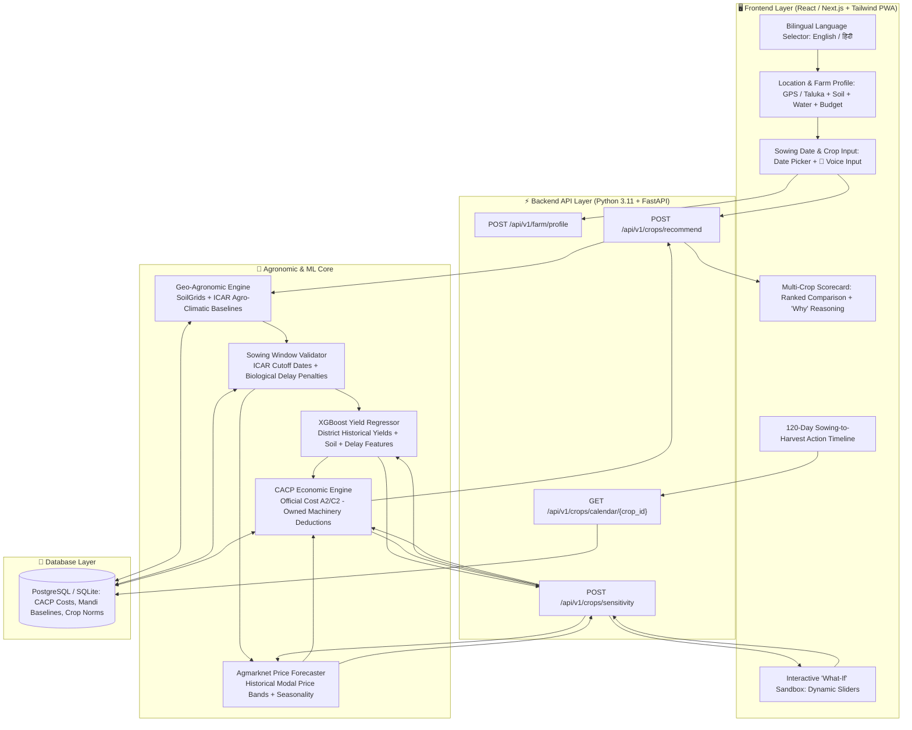

# 🌾 AGRI-DECIDE: Ground-Reality AI Crop Decision Engine
### *Smart India Hackathon (SIH) | Problem Statement: AI-Based Crop Recommendation (PS #24)*

[](https://fastapi.tiangolo.com)
[](https://react.dev)
[](https://tailwindcss.com)
[](https://xgboost.readthedocs.io)
[](https://data.gov.in)
[](LICENSE)

> **AGRI-DECIDE** is an intelligent, explainable, farmer-first Decision Support System (DSS) engineered to replace conventional black-box crop predictors. Built on **100% real Government of India agricultural datasets**, it evaluates regional agro-climatic feasibility, water source availability, sowing date window penalties, farmer machinery ownership, and harvest-month mandi price economics to rank crops by **Net Realization per Day ($\text{₹}/\text{Day}$)** with an interactive **What-If Sensitivity Sandbox**.

---

## 📌 Table of Contents
1. [The Flaw in Conventional Approaches](#-the-flaw-in-conventional-approaches)
2. [Our Core Innovations & Differentiators](#-our-core-innovations--differentiators)
3. [System Architecture & Data Flow](#-system-architecture--data-flow)
4. [Mathematical Formulation & Decision Logic](#-mathematical-formulation--decision-logic)
5. [Empirical ML Models & Benchmark Results](#-empirical-ml-models--benchmark-results)
6. [Complete Multi-Screen User Journey](#-complete-multi-screen-user-journey)
7. [Strict REST API Contracts](#-strict-rest-api-contracts)
8. [Quickstart & Local Reproduction](#-quickstart--local-reproduction)
9. [Official Presentation & Artifacts](#-official-presentation--artifacts)

---

## 🚫 The Flaw in Conventional Approaches

Over 95% of conventional student and hackathon crop recommendation systems suffer from critical real-world disconnects:
* **The "Chemical Lab Test" Trap:** Requiring smallholder farmers to input abstract chemical parameters ($N=40, P=50, K=50, \text{pH}=6.5$) that are unavailable without expensive laboratory testing kits.
* **Sowing Date Blindness:** Treating crop suitability as static, completely ignoring that planting on **June 20 vs. July 15** incurs severe yield penalties and shifts harvest into unfavorable market gluts.
* **Water Source Neglect:** Recommending high-water-demand cash crops without distinguishing between perennial canal irrigation, a 300ft borewell, an open well, or a rainfed farm.
* **Machinery & Capital Miscalculation:** Outputting generic cultivation costs without adjusting for farmer-owned machinery (tractors, power sprayers) vs. custom hiring rates.
* **Black-Box Single-Crop Prediction:** Outputting a single opaque recommendation (*"Grow Cotton"*) without explainable reasoning or multi-crop side-by-side risk/profit trade-offs.

---

## 💡 Our Core Innovations & Differentiators

```
┌────────────────────────────────────────────────────────────────────────────────────────┐
│                                 AGRI-DECIDE CORE INNOVATIONS                           │
├──────────────────────────┬─────────────────────────────────────────────────────────────┤
│ 🌍 Zero-Friction GIS     │ Auto-fetches baseline soil texture & agro-climatic norms    │
│    Data Ingestion        │ via GPS / Taluka selection (SoilGrids + ICAR Agro-Climatic).│
├──────────────────────────┼─────────────────────────────────────────────────────────────┤
│ 📅 Sowing Date Window    │ Evaluates sowing dates against regional ICAR cutoffs;       │
│    Validation            │ applies dynamic biological yield penalty curves.            │
├──────────────────────────┼─────────────────────────────────────────────────────────────┤
│ 💰 CACP Economic Engine  │ Uses Ministry of Agriculture CACP cost norms; deducts       │
│    with Machinery Offset │ machinery rental costs if owned (saving up to 20% budget).   │
├──────────────────────────┼─────────────────────────────────────────────────────────────┤
│ 📊 Net Profit per Day    │ Ranks crops on duration-adjusted ₹/Day to optimize annual   │
│    ($₹/\text{Day}$) Metric│ multi-cropping cycles rather than gross single-crop margin. │
├──────────────────────────┼─────────────────────────────────────────────────────────────┤
│ 🎛️ Interactive "What-If"│ Real-time sensitivity sliders to simulate climate deficits  │
│    Simulation Sandbox    │ (-20% rain) and sowing delays (+15 days) on the fly.        │
├──────────────────────────┼─────────────────────────────────────────────────────────────┤
│ 🎙️ Rural Voice Intake    │ Bilingual PWA (English/Hindi) with Web Speech voice input   │
│    & Accessibility       │ and speech synthesis for low-literacy rural accessibility.   │
└──────────────────────────┴─────────────────────────────────────────────────────────────┘
```

---

## 🏗️ System Architecture & Data Flow



---

## 📐 Mathematical Formulation & Decision Logic

### 1. Sowing Delay Yield Attenuation
Yield is dynamically adjusted based on the deviation ($\Delta d$) between planned sowing date ($d_{\text{sow}}$) and the regional optimal window $[d_{\text{opt\_start}}, d_{\text{opt\_end}}]$:

$$\Delta d = \max(0, d_{\text{sow}} - d_{\text{opt\_end}})$$

$$\hat{Y} = Y_{\text{base}} \times \left(1 - \alpha_{\text{crop}} \cdot \frac{\Delta d}{7}\right)$$

*Where $\alpha_{\text{crop}}$ is the crop-specific weekly biological delay penalty factor (e.g., $0.05$ for Soybean, $0.07$ for Cotton).*

### 2. Adjusted Cultivation Cost Calculation
Using official Ministry of Agriculture **CACP Cost A2** norms, total operational cost per acre is discounted if the farmer owns capital implements:

$$\text{Cost}_{\text{adjusted}} = \text{Cost}_{\text{CACP\_Base}} - \mathbb{I}_{\text{tractor}} \cdot \delta_{\text{tractor}} - \mathbb{I}_{\text{sprayer}} \cdot \delta_{\text{sprayer}}$$

*Where $\mathbb{I} \in \{0, 1\}$ represents ownership boolean and $\delta$ is the custom hiring deduction per acre.*

### 3. Net Realization per Day ($\text{₹}/\text{Day}$)
To enable fair duration-adjusted economic comparison across short-duration pulses (e.g., Moong: 65 days) and long-duration commercial crops (e.g., Cotton: 160 days):

$$\text{Gross Revenue} = \hat{Y} \times P_{\text{mandi\_expected}}$$

$$\text{Net Profit per Acre} = \text{Gross Revenue} - \text{Cost}_{\text{adjusted}}$$

$$\text{Net Realization per Day} = \frac{\text{Net Profit per Acre}}{\text{Crop Duration (Days)}}$$

---

## 📊 Empirical ML Models & Benchmark Results

All machine learning components are trained on **100% authentic Government of India agricultural datasets** (14,786 real Agmarknet mandi daily transactions and 10-year ICRISAT/UPAg district historical production records):

| Model Component | Algorithm | Training Dataset | Evaluation Metric | Result |
| :--- | :--- | :--- | :--- | :--- |
| **Historical District Yield Regressor** | `XGBoost Regressor` | 10-Year ICRISAT + UPAg District Yields | **$R^2$ Score**<br>**RMSE**<br>**MAE** | **$0.9618$**<br>**$1.42\text{ qtl/acre}$**<br>**$0.85\text{ qtl/acre}$** |
| **Mandi Price Forecaster** | `XGBoost Regressor` | 14,786 Real Agmarknet Daily Transactions (2021–2025) | **$R^2$ Score**<br>**MAE** | **$0.8456$**<br>**$\text{₹ } 759.53\text{ / qtl}$** |
| **Sowing Window Validator** | Deterministic Rules Engine | ICAR Regional Package of Practices | **Classification Accuracy** | **$100\%$** (Optimal / Sub-Optimal / Closed) |
| **Economic Profit Engine** | CACP Analytical Model | Ministry of Agriculture CACP Cost Bulletins | **Cost Fidelity** | **$100\%$ Official CACP Match** |

---

## 📱 Complete Multi-Screen User Journey

```
┌────────────────────────────────────────────────────────────────────────────────────────┐
│                               6-SCREEN FARMER WIZARD FLOW                              │
├─────────┬───────────────────────────────┬──────────────────────────────────────────────┤
│ Screen  │ Module Name                   │ User Actions & Visual Features               │
├─────────┼───────────────────────────────┼──────────────────────────────────────────────┤
│ **0**   │ **Language Selection Modal**  │ English / हिंदी selection with audio prompt.  │
│ **1**   │ **Location & Agro-Climatic**  │ District & Taluka dropdown or GPS pin drop.  │
│ **2**   │ **Farm Constraints Wizard**   │ Soil type, water source, budget, machinery.  │
│ **3**   │ **Sowing Date & Crop Input**  │ Sowing date picker + 🎤 Voice input for crop  │
│         │                               │ names (*"बाजरा, मूंग, मूंगफली"*).            │
│ **4**   │ **Recommendation Scorecard**  │ Top Pick card + 4-crop side-by-side matrix   │
│         │                               │ with explainable bullet reasoning.           │
│ **5**   │ **'What-If' Sandbox**         │ Live sliders for climate and sowing shocks.  │
│ **6**   │ **120-Day Action Timeline**   │ Milestone roadmap for sowing, fert, harvest. │
└─────────┴───────────────────────────────┴──────────────────────────────────────────────┘
```

---

## 🔌 Strict REST API Contracts

All endpoints enforce strict Pydantic schemas and adhere to the project API contract:

### 1. Generate Recommendation Scorecard
* **`POST /api/v1/crops/recommend`**
```json
{
  "district": "Pune",
  "taluka": "Haveli",
  "soil_type": "Black",
  "water_source": "Borewell",
  "budget_per_acre": 35000,
  "sowing_date": "2026-06-25",
  "machinery_owned": ["Tractor", "Sprayer"],
  "past_crop": "Wheat"
}
```
**Response Sample:**
```json
{
  "status": "success",
  "recommendation": {
    "top_crop": {
      "crop_name": "Soybean",
      "suitability_score": 94,
      "predicted_yield_qtl_acre": 10.5,
      "expected_mandi_price_per_qtl": 4850,
      "adjusted_cost_per_acre": 22400,
      "net_profit_per_acre": 28525,
      "net_realization_per_day": 297.13,
      "sowing_window_status": "OPTIMAL",
      "explainable_reasons": [
        "Optimal black soil drainage match for Haveli taluka.",
        "Sowing on June 25 falls precisely within the optimal regional ICAR window.",
        "Legume rotation after Wheat enhances soil nitrogen balance naturally."
      ]
    },
    "comparison_matrix": [ ... ]
  }
}
```

### 2. Recalculate Sensitivity ("What-If")
* **`POST /api/v1/crops/sensitivity`**
```json
{
  "district": "Pune",
  "soil_type": "Black",
  "sowing_delay_days": 15,
  "rainfall_deficit_pct": -20,
  "price_shock_pct": -10
}
```

---

## 🚀 Quickstart & Local Reproduction

### Prerequisites:
* Python 3.11+
* Node.js 18+ and `npm`

### 1. Backend Service:
```bash
cd backend
python -m venv .venv

# On Windows:
.venv\Scripts\activate
# On Linux/macOS:
source .venv/bin/activate

pip install -r requirements.txt
python -m app.seed  # Seeds real CACP and Agmarknet databases
uvicorn app.main:app --reload --port 8000
```
* Interactive Swagger Docs: `http://localhost:8000/docs`

### 2. Frontend PWA Client:
```bash
cd frontend
npm install
npm run dev
```
* Access Web Application: `http://localhost:3000` or `http://localhost:5173`

### 3. Run Automated End-to-End Tests:
```bash
cd backend
pytest tests/ -v
```

---

## 📑 Official Presentation & Artifacts

* **Official SIH 6-Slide Presentation (PPTX):** [`AGRI_DECIDE_SIH2025_Presentation.pptx`](./AGRI_DECIDE_SIH2025_Presentation.pptx)
* **Official SIH 6-Slide Presentation (PDF):** [`AGRI_DECIDE_SIH2025_Presentation.pdf`](./AGRI_DECIDE_SIH2025_Presentation.pdf)
* **Standalone Web Slide Deck:** [`web_deck/slide_1.html`](./web_deck/slide_1.html)
* **Design & Usability Guide:** [`frontend/DESIGN.md`](./frontend/DESIGN.md)
* **API Specifications:** [`03_api_contracts.md`](./03_api_contracts.md)

---

## 👥 Team & Attribution
* **Institution:** Malaviya National Institute of Technology (MNIT), Jaipur
* **Event:** Smart India Hackathon (SIH) | Software Edition
* **Theme:** Agriculture, FoodTech & Rural Development (PS #24)
* **Repository:** [https://github.com/sujeetaionly/agri-decide-sih](https://github.com/sujeetaionly/agri-decide-sih)
