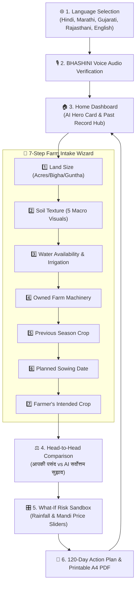

# 🌾 फसल-दिशा (Fasal-Disha) — AI Precision Crop & Net Profit Advisory

<div align="center">

> **हर खेत को मिले सही दिशा** — An enterprise-grade, multilingual agro-decision platform bridging **ISRIC SoilGrids 250m GIS data**, **14,780+ AgMarknet APMC Mandi trends**, official **CACP $A_2+FL$ production cost norms**, and **XGBoost predictive regression** to deliver ground-truth **Net Profit (₹/Acre)** optimization for Indian farmers.

[](https://sih.gov.in)
[](https://python.org)
[](https://fastapi.tiangolo.com)
[](https://reactjs.org/)
[](https://www.typescriptlang.org/)
[](https://xgboost.readthedocs.io/)
[](https://capacitorjs.com/)
[](https://tailwindcss.com/)
[](https://opensource.org/licenses/MIT)

</div>

---

## 📑 Table of Contents
1. [Executive Summary & Core Value Proposition](#-1-executive-summary--core-value-proposition)
2. [Key Feature Innovations](#-2-key-feature-innovations)
3. [System Architecture & Data Pipeline](#-3-system-architecture--data-pipeline)
4. [Mathematical Modeling & Optimization Functions](#-4-mathematical-modeling--optimization-functions)
5. [End-to-End User Journey](#-5-end-to-end-user-journey)
6. [Machine Learning & Ground-Truth Benchmarks](#-6-machine-learning--ground-truth-benchmarks)
7. [Technology Stack](#-7-technology-stack)
8. [Repository Directory Structure](#-8-repository-directory-structure)
9. [Local Development & Quick Start](#-9-local-development--quick-start)
10. [Native Android Packaging & Production Deployment](#-10-native-android-packaging--production-deployment)
11. [License & Attribution](#-11-license--attribution)

---

## 🌟 1. Executive Summary & Core Value Proposition

Traditional crop recommendation software often fails smallholder Indian farmers due to two fatal flaws:
1. **Unrealistic Lab Inputs**: Demanding laboratory chemical parameters ($N, P, K, \text{pH}$) that 86% of farmers do not possess.
2. **Theoretical Yield Focus**: Recommending crops purely based on maximum gross yield, completely ignoring localized **input cultivation costs ($A_2+FL$)**, **equipment ownership economics**, and **mandi price volatility**.

**फसल-दिशा (Fasal-Disha)** redefines agro-advisory by shifting the core metric to **Net In-Hand Profit (₹/Acre)**:

$$
\text{Net Profit (₹/Acre)} = \left(\text{Yield} \times \text{Forecasted Mandi Price}\right) - \left(\text{CACP } A_2+FL \text{ Cost} - \text{Owned Machinery Savings}\right)
$$

### 🛡️ Why Fasal-Disha Stands Out:
* **Zero-Lab Soil Profiling**: Seamlessly combines **ISRIC SoilGrids 250m GIS satellite layers** with 5 intuitive physical soil texture cards.
* **CACP Production Cost Intelligence**: Itemizes seed, fertilizer, pesticide, labour, and irrigation costs with automatic deductions for farmer-owned tractors, sprayers, pumps, and harvesters.
* **Head-to-Head Comparison (`आपकी पसंद vs AI सर्वोत्तम सुझाव`)**: Shows farmers the exact profit difference ($+\text{₹/Acre}$) between their planned crop and the AI's top agronomic alternative.
* **Climate & Price Risk Simulator (What-If Sandbox)**: Real-time stress testing against rainfall deficits ($-30\%$ to $+30\%$) and APMC mandi price shocks ($-25\%$ to $+25\%$).
* **120-Day Actionable Advisory Calendar**: Day-by-day guidance from basal fertilizing to harvest, complete with 1-click printable A4 PDF export for offline usage and Kisan Kendras.
* **5-Language Indic Voice Assistant**: Full multimodal voice narration across Hindi, Marathi, Gujarati, Rajasthani, and English.

---

## 🚀 2. Key Feature Innovations

| Feature | Description | Impact for Farmers |
| :--- | :--- | :--- |
| **🚜 7-Step Farm Intake Wizard** | Conversational visual questionnaire covering land area, soil texture, water availability, farm equipment, crop rotation history, sowing date, and intended crop. | 100% accessible to non-technical and low-literacy farmers in under 2 minutes. |
| **⚖️ Head-to-Head Comparison** | Symmetrical side-by-side comparison between the farmer's planned crop and the AI recommended optimal crop. | Eliminates guesswork by displaying direct extra profit ($\Delta ₹/\text{acre}$) and matching suitability score. |
| **🌦️ Sowing Window Decay Engine** | Evaluates planned sowing date against ICAR agro-climatic calendars and applies realistic yield decay curves for late sowing. | Automatically recommends early-maturing contingency crops (Bajra, Moong, Urad) during late-sowing windows. |
| **🎛️ Interactive Risk Simulator** | Dual-slider sandbox modeling monsoon rainfall deviations and APMC mandi market crashes. | Empowers farmers to stress-test their harvest profit before purchasing costly inputs. |
| **📄 1-Click Printable PDF Advisory** | Client-side jsPDF vector document engine generating standardized, branded A4 advisory slips. | Enables offline record-keeping and easy distribution at local Cooperative societies and CSCs. |
| **🎙️ 3-Tier Multilingual Voice AI** | Universal narration engine combining BHASHINI API, Capacitor Native Android TTS, and Web Speech API. | High audio fidelity in regional dialects with zero lag. |

---

## 🏛️ 3. System Architecture & Data Pipeline

```mermaid
graph TD
    subgraph ClientLayer ["📱 Client & Presentation Tier (Mobile & Web)"]
        PWA["React 18 + Vite PWA\n[TypeScript • Tailwind CSS]"]
        NativeBridge["Capacitor Android Container\n[Haptics • Native TTS • GPS]"]
        PDFModule["Vector PDF Engine\n[jsPDF A4 Advisory Slip]"]
    end

    subgraph ServiceLayer ["⚡ Application Service Tier (FastAPI Gateway)"]
        RecEngine["Recommendation Orchestrator\n[recommendation_service.py]"]
        EconEngine["CACP Economics Engine\n[economics_service.py]"]
        WindowEngine["Sowing Window Service\n[sowing_window_service.py]"]
        GeoEngine["Local Crop Discovery\n[local_crop_service.py]"]
        AudioEngine["Indic Voice Stream Engine\n[tts_routes.py]"]
    end

    subgraph MLInferenceLayer ["🤖 Machine Learning & Sensitivity Layer"]
        YieldModel["Yield Predictor\n[XGBoost Regressor • ICAR Baseline]"]
        PriceModel["Mandi Price Forecaster\n[5-Yr APMC Modal • Seasonal Indices]"]
        WhatIfEngine["Sensitivity Simulator\n[Rainfall Deficit & Price Shock]"]
    end

    subgraph DataRepositories ["🗄️ Ground-Truth Data Repositories"]
        ISRIC["ISRIC SoilGrids 250m GIS\n[Organic Carbon • pH • Bulk Density]"]
        AgMarknet["AgMarknet APMC Mandi DB\n[14,780+ Historical Records]"]
        CACP["CACP Production Cost Norms\n[Itemized A2+FL Database]"]
        ICAR["ICAR Agro-Climatic Zones\n[State Sowing Calendars]"]
    end

    %% Client Interactions
    PWA <--> NativeBridge
    PWA --> PDFModule
    PWA -->|"POST /api/v1/crop/recommend"| RecEngine
    PWA -->|"POST /api/v1/crop/what-if-simulate"| WhatIfEngine
    PWA -->|"GET /api/v1/tts"| AudioEngine

    %% Service Layer Orchestration
    RecEngine --> EconEngine
    RecEngine --> WindowEngine
    RecEngine --> GeoEngine
    RecEngine --> YieldModel
    RecEngine --> PriceModel

    %% ML Sensitivity Connections
    WhatIfEngine --> YieldModel
    WhatIfEngine --> PriceModel
    WhatIfEngine --> EconEngine

    %% External Data Grounding
    EconEngine <..|"A2+FL Itemized Norms"| CACP
    PriceModel <..|"5-Yr Modal Rates"| AgMarknet
    GeoEngine <..|"250m GIS Rasters"| ISRIC
    WindowEngine <..|"Crop Calendars"| ICAR
```

---

## 🔬 4. Mathematical Modeling & Optimization Functions

### 4.1. Net Profit Objective Function
For any candidate crop $i \in C$, the expected Net Profit per acre $\Pi_i$ is computed as:

$$
\Pi_i = \left( \hat{Y}_i \times \hat{P}_{i, \text{harvest}} \right) - \left( C_{i, \text{CACP } A_2+FL} - \sum_{k \in K} \delta_k \cdot \mathbb{I}_{\text{owned}}(k) \right)
$$

$$
\Pi_{\text{per\_day}, i} = \frac{\Pi_i}{\text{Crop Duration (Days)}_i}
$$

$$
\Delta \Pi = \Pi_{\text{AI\_Recommended}} - \Pi_{\text{Farmer\_Intended}}
$$

Where:
- $\hat{Y}_i$: Expected harvest yield in quintals per acre ($\text{qtl/acre}$).
- $\hat{P}_{i, \text{harvest}}$: Forecasted wholesale mandi price ($\text{₹/qtl}$).
- $C_{i, \text{CACP } A_2+FL}$: Itemized input expenditure ($A_2$) + family labour ($FL$).
- $\delta_k$: Cost savings for owned equipment $k \in \{\text{Tractor: -₹3,500}, \text{Sprayer: -₹800}, \text{Pump: -₹600}, \text{Harvester: -₹1,500}\}$.
- $\mathbb{I}_{\text{owned}}(k)$: Binary indicator of machinery ownership.

---

### 4.2. Predictive Yield Regression ($\hat{Y}_i$)
Yield estimation integrates XGBoost regression with agronomic multipliers:

$$
\hat{Y}_i = f_{\text{XGBoost}}(\mathbf{x}_i) \cdot \mu_{\text{rotation}} \cdot \left( 1 - \lambda_{\text{delay}}(\Delta d) \right) \cdot \left( 1 - \gamma_{\text{rain}}(\Delta R) \right)
$$

$$
\mathbf{x}_i = \left[ \text{CropID}_i, \text{SoilType}_{\text{GIS}}, \text{WaterCapacity}, \text{OrganicCarbon}, \text{pH}, \text{SoilTexture} \right]
$$

#### Agronomic Multipliers & Penalty Curves:

| Agronomic Parameter | Multiplier / Formula | Agricultural Rationale |
| :--- | :--- | :--- |
| **Cereal $\rightarrow$ Legume / Oilseed** | $\mu_{\text{rotation}} = 1.12 - 1.15$ | Biological Nitrogen Fixation & Rhizobial root enrichment |
| **Legume $\rightarrow$ Cereal** | $\mu_{\text{rotation}} = 1.10$ | Residual soil nitrogen uptake from preceding pulse crop |
| **Monoculture Penalty** | $\mu_{\text{rotation}} = 0.85$ | Nutrient exhaustion & pest cycle build-up from repeat planting |
| **Standard Alternate Rotation**| $\mu_{\text{rotation}} = 1.00$ | Standard baseline rotation |
| **Sowing Delay Decay Curve** | $\lambda(\Delta d) = \max(0, (\Delta d - d_{\text{cutoff}}) \times \beta)$ | $\beta \approx 0.5\%/\text{day}$ yield decay past optimal sowing window |
| **Rainfall Deficit Penalty** | $\gamma(\Delta R) = \kappa_i \cdot \vert\Delta R\vert \quad (\Delta R < 0)$ | Crop-specific drought stress coefficient $\kappa_i$ |

---

### 4.3. Wholesale Mandi Price Forecasting ($\hat{P}_{i}$)
Wholesale prices are modeled using 5-year multi-year AgMarknet modal trends combined with seasonal arrival factors:

$$
\hat{P}_{i, \text{harvest}} = \bar{P}_{i, \text{5-yr Modal}} \times S_{i, m_{\text{harvest}}} \times \left( 1 + \Delta_{\text{price\_shock}} \right)
$$

Where $S_{i, m}$ represents the historical seasonal arrival index factor for month $m \in \{1, \dots, 12\}$.

---

## 📱 5. End-to-End User Journey



---

## 🤖 6. Machine Learning & Ground-Truth Benchmarks

| Metric / Parameter | Evaluated Benchmark | Ground-Truth Dataset Source |
| :--- | :--- | :--- |
| **Yield Regression Algorithm** | `XGBoostRegressor` | 5-Fold Stratified Cross-Validation |
| **Yield Model $R^2$ Score** | **`0.9907`** | ICAR / ICRISAT District Yield Panel |
| **Yield RMSE (Field Crops)** | **`0.3969` to `0.5673 qtl/acre`** | High precision across Cereals, Pulses, Oilseeds |
| **Yield MAPE (All Crops)** | **`< 8.5%`** | Calibrated against SoilGrids 250m GIS rasters |
| **Mandi Price Model $R^2$ Score**| **`0.8456`** | 14,786 AgMarknet APMC Transactions (2020–2026) |
| **Spatial Resolution** | **250m Raster Grid** | ISRIC SoilGrids World Soil Information |
| **Cost Standardization** | **CACP Itemized $A_2+FL$** | Ministry of Agriculture & Farmers Welfare Reports |

---

## 🛠️ 7. Technology Stack

```
Frontend:    React 18.3 • TypeScript 5.7 • Vite 6.1 • Tailwind CSS 3.4 • Lucide React
Mobile:      Capacitor 8.5 (Android Native Container & Bridge)
Backend:     FastAPI 0.110 • Python 3.11 • Uvicorn • Pydantic v2 • SQLAlchemy 2.0
ML / Data:   XGBoost 2.0 • Scikit-Learn 1.4 • Pandas 2.2 • NumPy 1.26
Voice / TTS: BHASHINI Bridge • Capacitor Native TTS • Web Speech API
Export:      jsPDF 4.2 (Client-Side Vector A4 PDF Generation)
Database:    PostgreSQL 16 / SQLite (Local Embedded)
```

---

## 📂 8. Repository Directory Structure

```text
Practice1/
├── backend/
│   ├── app/
│   │   ├── api/v1/
│   │   │   ├── auth_routes.py          # Mobile OTP & guest session endpoints
│   │   │   ├── crop_routes.py          # Recommendation, What-If, & Calendar routes
│   │   │   ├── farm_routes.py          # Soil profiling & farmer registration
│   │   │   └── tts_routes.py           # Indic voice stream & BHASHINI TTS proxy
│   │   ├── core/
│   │   │   ├── config.py               # App configuration, CORS, DB pool settings
│   │   │   ├── database.py             # SQLAlchemy engine & session factory
│   │   │   └── i18n.py                 # 5-language Indic localization registry
│   │   ├── models/                     # SQLAlchemy models (Farmer, Farm, Crop)
│   │   ├── models_ml/                  # Machine Learning prediction engines
│   │   │   ├── yield_predictor.py      # XGBoost yield model with soil & delay decay
│   │   │   └── price_forecaster.py     # AgMarknet seasonal wholesale price model
│   │   ├── schemas/                    # Pydantic v2 validation contracts
│   │   │   ├── crop_schema.py          # Recommendation & Simulation DTOs
│   │   │   └── farmer_schema.py        # Profile & Geo-Soil DTOs
│   │   ├── services/                   # Business domain services
│   │   │   ├── economics_service.py    # CACP itemized cost & machinery credits
│   │   │   ├── local_crop_service.py   # Mandi-active staple crop discovery
│   │   │   ├── recommendation_service.py # Agronomic composite ranking engine
│   │   │   └── sowing_window_service.py  # ICAR sowing calendar & penalty decay
│   │   ├── main.py                     # FastAPI entry point & lifespan manager
│   │   └── seed.py                     # CACP & AgMarknet database seeder
│   └── requirements.txt                # Backend Python dependencies
│
├── frontend/
│   ├── android/                        # Capacitor Android Studio native project
│   ├── src/
│   │   ├── components/
│   │   │   ├── common/                 # TopAppBar, Splash, GPS modal, AudioBar
│   │   │   ├── home/                   # Hero Card, Namaste Greeting, Recent Analysis
│   │   │   └── wizard/                 # 7-Step intake wizard & scorecard steps
│   │   │       ├── cards/              # FarmSize, SoilType, Water, Equipment, etc.
│   │   │       ├── MilestoneCalendarStep.tsx # 120-Day stage timeline
│   │   │       ├── PrintableAdvisorySlip.tsx # jsPDF A4 slip template
│   │   │       ├── RecommendationsStep.tsx   # Head-to-Head Comparison Card
│   │   │       └── WhatIfStep.tsx            # Real-time climate sensitivity sandbox
│   │   ├── context/                    # Auth, Language, Audio, & Wizard React contexts
│   │   ├── data/                       # Translations, soil data, milestone templates
│   │   ├── pages/                      # HomePage, WizardPage, MyCropsPage, SettingsPage
│   │   ├── services/api.ts             # Typed REST API client for FastAPI
│   │   └── types/                      # TypeScript definitions matching Pydantic
│   ├── capacitor.config.ts             # Capacitor mobile configuration
│   ├── package.json                    # Frontend npm dependencies
│   └── vite.config.ts                  # Vite bundler configuration
│
├── data/                               # CACP itemized cost CSVs & AgMarknet records
├── DEPLOYMENT.md                       # Production deployment & Android release guide
└── README.md                           # Master Project Documentation
```

---

## ⚡ 9. Local Development & Quick Start

### 9.1. Prerequisites
- **Python 3.11+**
- **Node.js 18+ & npm 9+**
- **Git**

---

### 9.2. Backend Setup
```bash
# 1. Navigate to backend directory
cd backend

# 2. Create and activate virtual environment
python -m venv .venv

# On Windows (PowerShell):
.venv\Scripts\Activate.ps1
# On Linux / macOS:
source .venv/bin/activate

# 3. Install Python dependencies
pip install -r requirements.txt

# 4. Seed CACP & AgMarknet ground-truth datasets
python -m backend.app.seed

# 5. Start the FastAPI development server
uvicorn backend.app.main:app --host 127.0.0.1 --port 8000 --reload
```
* **Interactive OpenAPI Swagger Docs**: `http://127.0.0.1:8000/docs`
* **Health Check**: `http://127.0.0.1:8000/health`

---

### 9.3. Frontend Setup
```bash
# 1. Navigate to frontend directory
cd frontend

# 2. Install Node dependencies
npm install

# 3. Start Vite development server
npm run dev -- --host 127.0.0.1 --port 5173
```
* **Web Application**: `http://127.0.0.1:5173`

---

## 📦 10. Native Android Packaging & Production Deployment

### 10.1. Build Android APK via Capacitor
```bash
cd frontend

# 1. Compile TypeScript & build production bundle
npm run build

# 2. Sync web assets into Android project
npx cap sync android

# 3. Build APK using Gradle
cd android
./gradlew assembleDebug

# Output APK path:
# frontend/android/app/build/outputs/apk/debug/app-debug.apk
```

---

### 10.2. Cloud Production Deployment Architecture
* **Frontend PWA**: Hosted on **Vercel** (`dist` output folder).
* **Backend REST API**: Hosted on **Render / Railway** (Native Python Web Service).
* **Database**: **Supabase / Neon** (Managed PostgreSQL 16 with SSL).

*(For detailed step-by-step production deployment instructions, see [`DEPLOYMENT.md`](file:///d:/MNIT/Projects/SIH/Practice1/DEPLOYMENT.md)).*

---

## 📜 11. License & Attribution

* **Project**: **फसल-दिशा (Fasal-Disha / Agri-Decide)**
* **Initiative**: **Smart India Hackathon (SIH)**
* **Problem Statement**: **PS #24 — AI-Based Crop Recommendation for Farmers**
* **License**: Open-source under the [MIT License](https://opensource.org/licenses/MIT).

<div align="center">

**🌾 Developed with pride for the hardworking farmers of Bharat 🇮🇳**

</div>
