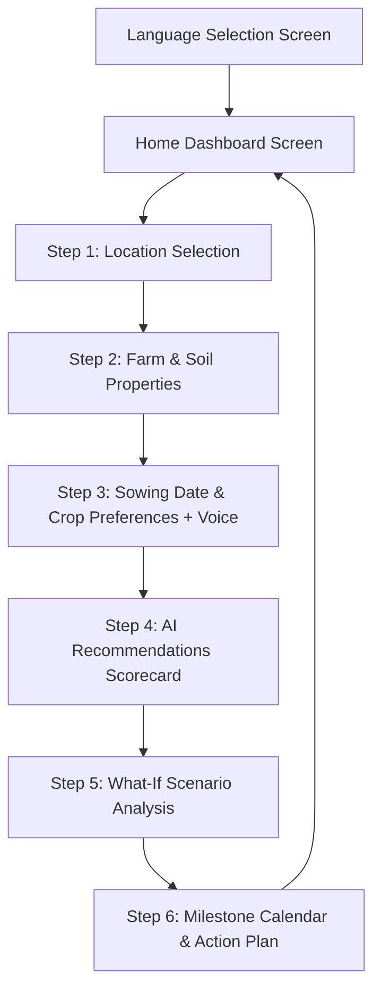

# KrishiWise AI (Agri-Decide) — Design System Specification

> **Project Source:** Stitch MCP (`projects/14068565236617569837`)  
> **Brand & Philosophy:** **Pragmatic Optimism** — Blending traditional agricultural wisdom with precision AI decision-making.  
> **Visual Direction:** **Corporate Modern with a Tactile Twist** — High legibility, high contrast, oversized outdoor-friendly interactive elements, and sturdy physical-tool ergonomics.

---

## 1. Color Palette

The color system is built on **Material Design 3 tokens** rooted in the natural lifecycle of agriculture: deep forest green for vital growth, light sap green for progress/accents, earth brown for soil stability, and high-contrast tinted neutral surfaces for outdoor sunlight legibility.

### Primary Palette (Growth & Primary Actions)
| Token Name | Hex Code | Purpose / Usage |
| :--- | :--- | :--- |
| `primary` | `#0d631b` | Main brand color, primary CTA buttons, active state indicators, key highlights |
| `on-primary` | `#ffffff` | Text and icons placed on top of `primary` surfaces |
| `primary-container` | `#2e7d32` | Header badges, active indicator chips, icon circular containers |
| `on-primary-container` | `#cbffc2` | High-contrast text on `primary-container` |
| `inverse-primary` | `#88d982` | Highlights on dark/inverted surfaces |
| `primary-fixed` | `#a3f69c` | Fixed light accent pills and badges |
| `primary-fixed-dim` | `#88d982` | Secondary accent pills |
| `on-primary-fixed` | `#002204` | High-contrast dark text on `primary-fixed` |
| `on-primary-fixed-variant` | `#005312` | Dark text on tinted green containers |

### Secondary Palette (Accents & Progress)
| Token Name | Hex Code | Purpose / Usage |
| :--- | :--- | :--- |
| `secondary` | `#3e6a00` | Support accents, secondary labels, sub-step indicators |
| `on-secondary` | `#ffffff` | Text on secondary surfaces |
| `secondary-container` | `#b9f474` | "Match %" high-visibility badges, progress bars, confidence tags |
| `on-secondary-container` | `#437000` | High-contrast green text on `secondary-container` |
| `secondary-fixed` | `#b9f474` | Accent indicators |
| `secondary-fixed-dim` | `#9ed75b` | Progress bar dim track |

### Tertiary Palette (Soil & Physical Earth)
| Token Name | Hex Code | Purpose / Usage |
| :--- | :--- | :--- |
| `tertiary` | `#6d4e45` | Earth/Soil categories, land-related badges, grounding elements |
| `on-tertiary` | `#ffffff` | Text on tertiary surfaces |
| `tertiary-container` | `#87665c` | Soil profile badges, earthen tag containers |
| `on-tertiary-container` | `#ffede9` | Text on tertiary container |
| `tertiary-fixed` | `#ffdbd0` | Light earth chips |
| `tertiary-fixed-dim` | `#e7bdb1` | Secondary earth chips |

### Neutral & Surface Palette (Sunlight & Glare Resistant)
| Token Name | Hex Code | Purpose / Usage |
| :--- | :--- | :--- |
| `background` | `#f5fced` | Base app background (soft pale celadon to reduce eye strain under sunlight) |
| `on-background` | `#171d14` | High-contrast dark charcoal text on background |
| `surface` | `#f5fced` | Default screen canvas |
| `on-surface` | `#171d14` | Primary high-contrast text |
| `surface-container-lowest` | `#ffffff` | Elevated pure white cards, modals, and input fields |
| `surface-container-low` | `#eff6e7` | Secondary containers, info box backgrounds, stepper rail |
| `surface-container` | `#e9f0e1` | Neutral chip backgrounds, toggle rails |
| `surface-container-high` | `#e3ebdc` | Hover states, card dividers, inactive button fills |
| `surface-container-highest` | `#dee5d6` | Disabled states, slider track background |
| `surface-variant` | `#dee5d6` | Borders, subtle dividers |
| `on-surface-variant` | `#40493d` | Secondary descriptive helper text, subtitles, meta labels |
| `surface-dim` | `#d5dcce` | Shadowed/dimmed background layers |
| `surface-bright` | `#f5fced` | High-visibility surface layer |
| `surface-tint` | `#1b6d24` | Surface tint accent |
| `outline` | `#707a6c` | Standard form element borders, card boundaries |
| `outline-variant` | `#bfcaba` | Subtle dividers, secondary card outlines |

### Functional & Semantic Colors
| Semantic Role | Hex Code / Color | Purpose / Usage |
| :--- | :--- | :--- |
| `error` | `#ba1a1a` | High-risk alerts, missing required fields, crop failure warnings |
| `error-container` | `#ffdad6` | Error alert banners, warning backgrounds |
| `on-error` | `#ffffff` | Text on error container |
| `on-error-container` | `#93000a` | Dark red text on error banners |
| **Water Blue** | `#0284c7` (bg `#e0f2fe`) | Water availability rating, irrigation source (Canal/Borewell) |
| **Alert Amber** | `#f59e0b` (bg `#fef3c7`) | Weather risk alerts, pest notifications, advisory notes |
| **Live Sync Green** | `#16a34a` (dot `#22c55e`) | Online live data status indicator |
| **Offline Sync Orange** | `#f97316` (dot `#ea580c`) | Offline cached data status indicator |

---

## 2. Typography

The design system utilizes **Noto Sans** for its industry-leading multi-script Unicode rendering, specially optimized for **Hindi (Devanagari)** and Indian regional languages alongside English.

- **Primary Font Family:** `'Noto Sans', sans-serif`
- **Icon Font:** `'Material Symbols Outlined'`, variable weights `100..700`, fill `0..1`
- **Multi-Script / Hindi Optimization Rules:**
  - Standard SaaS type sizes are scaled up by **15%** for field readability.
  - Line-heights are explicitly extended (1.4x–1.6x) to avoid clipping upper and lower Devanagari vowel markers (*matras* like ि, ी, ु, ू, े, ै, ो, ौ).
  - Weights below `400` are prohibited to guarantee visibility on low-end screens in direct sunlight.
  - All critical titles and instructions are bilingual or feature dedicated Hindi phonetic support.

---

## 3. Font Sizes & Hierarchy

| Type Style | Font Size | Line Height | Font Weight | Letter Spacing | Purpose / Usage |
| :--- | :--- | :--- | :--- | :--- | :--- |
| `headline-lg` | `30px` (`1.875rem`) | `40px` (`2.5rem`) | `700` (Bold) | `-0.02em` | Main screen titles, welcome hero headers |
| `headline-md` | `24px` (`1.5rem`) | `32px` (`2rem`) | `700` (Bold) | `normal` | Section headers, major step questions, crop titles |
| `headline-sm` | `20px` (`1.25rem`) | `28px` (`1.75rem`) | `600` (SemiBold) | `normal` | Sub-section headers, modal titles, card headers |
| `body-lg` | `18px` (`1.125rem`) | `28px` (`1.75rem`) | `400` (Regular) | `normal` | Main explanatory paragraphs, crop descriptions |
| `body-md` | `16px` (`1rem`) | `24px` (`1.5rem`) | `400` (Regular) | `normal` | Form labels, card descriptions, timeline text |
| `body-sm` | `14px` (`0.875rem`) | `20px` (`1.25rem`) | `400` (Regular) | `normal` | Helper text, secondary timestamps, subtitles |
| `label-lg` | `16px` (`1rem`) | `20px` (`1.25rem`) | `600` (SemiBold) | `0.05em` | Card tags, category badges, uppercase labels |
| `label-md` | `14px` (`0.875rem`) | `16px` (`1rem`) | `500` (Medium) | `normal` | Input field labels, chip titles, step numbers |
| `label-sm` | `12px` (`0.75rem`) | `16px` (`1rem`) | `500` (Medium) | `normal` | Metadata badges, status chips, caption notes |
| `button-text` | `18px` (`1.125rem`) | `24px` (`1.5rem`) | `700` (Bold) | `normal` | Primary & secondary action button labels |

---

## 4. Font Weights

- **`400` (Regular):** Body text, explanatory paragraphs, form helper copy.
- **`500` (Medium):** Input labels, chip text, dropdown menu options, secondary badges.
- **`600` (SemiBold):** Category subheadings, badge scores, timeline step titles, navigation labels.
- **`700` (Bold):** Screen titles, primary CTA buttons, featured crop names, key numeric values.

---

## 5. Spacing System

The layout follows an **8px baseline grid** engineered for tactile thumb interaction:

| Token / Value | Pixel Value | Typical Application |
| :--- | :--- | :--- |
| `space-1` / `0.5` | `4px` | Tight icon-to-label gaps, tag paddings |
| `space-2` / `base` | `8px` | Baseline unit, chip gaps, internal badge spacing |
| `space-3` | `12px` | Compact card gaps, inline item spacing |
| `space-4` / `gutter` | `16px` | Column gutters, standard card margins |
| `space-5` / `margin-mobile` | `20px` | Mobile screen outer side padding ("safe zone") |
| `space-6` / `card-padding` | `24px` | Standard card internal padding, section vertical rhythm |
| `space-8` | `32px` | Major section separators, modal padding |
| `space-12` | `48px` | Header clearance, minimum touch target height |
| `space-14` | `56px` | Standard primary CTA button height, input box height |
| `space-18` | `72px` | Fixed top app bar height, bottom nav bar height |
| `space-24` | `96px`–`100px` | Bottom scroll clearance for sticky action footer |

### Accessibility Touch Target Rule
- **Strict Minimum Touch Target:** `48px × 48px` (`min-h-[48px]`, `min-w-[48px]`).
- **Primary Buttons:** `56px` height for effortless one-handed thumb activation in outdoor field conditions.

---

## 6. Border Radius (Shapes)

The shape language is warm, soft, and approachable, avoiding aggressive brutalist sharp edges:

| Shape Token | Radius Value | Component Application |
| :--- | :--- | :--- |
| `rounded-sm` | `4px` (`0.25rem`) | Subtle tags, small status indicators |
| `rounded-DEFAULT` | `8px` (`0.5rem`) | Inner badges, small option chips |
| `rounded-md` | `12px` (`0.75rem`) | Secondary containers, stepper bars, segment pills |
| `rounded-lg` | `16px` (`1rem`) | Standard cards, text input fields, selection option tiles |
| `rounded-xl` | `24px` (`1.5rem`) | Primary action buttons, featured hero cards, recommendation cards |
| `rounded-t-[32px]` | `32px` top radius | Bottom sheet modals (Voice Assistant sheet) |
| `rounded-full` | `9999px` (Pill) | Icon buttons, TTS "सुनें" badges, full pill action buttons, avatars |

---

## 7. Shadows & Elevation

Depth is used purposefully to communicate tangibility and interactivity:

| Elevation Level | CSS Shadow Definition | Usage |
| :--- | :--- | :--- |
| **Level 0 (Flat)** | `shadow-none` | Default canvas background, flat inputs |
| **Level 1 (Subtle)** | `0px 4px 12px rgba(0, 0, 0, 0.04)` | Standard content cards, selection tiles, info boxes |
| **Level 2 (Lifted)** | `0px 4px 12px rgba(0, 0, 0, 0.08)` | Featured recommendation cards, hover states, top app bar |
| **Level 3 (Floating)** | `0px -8px 24px rgba(0, 0, 0, 0.12)` | Bottom sheets, voice assistant overlay modal |
| **CTA Glow** | `0px 8px 16px rgba(13, 99, 27, 0.20)` | Primary Forest Green button highlight |
| **Sticky Bottom Bar** | `0px -4px 12px rgba(0, 0, 0, 0.08)` | Fixed bottom action footer shadow |

### Tactile Feedback Rule
- When pressed, all primary and secondary buttons downshift by **2px** and remove their drop shadow:  
  `active:translate-y-[2px] active:shadow-none transition-all duration-150`

---

## 8. Buttons & Interactive Controls

### Primary CTA Button
- **Height:** `56px` (`min-h-[56px]`)
- **Width:** `w-full` (Full width on mobile)
- **Background:** `bg-primary` (`#0d631b`)
- **Hover:** `hover:bg-primary-container` (`#2e7d32`)
- **Text:** `text-on-primary` (`#ffffff`), `font-bold text-[18px]` (`button-text`)
- **Shape:** `rounded-xl` (24px) or `rounded-full`
- **Shadow:** `shadow-[0px_8px_16px_rgba(13,99,27,0.2)]`
- **Icon:** Trailing `arrow_forward` or action icon

### Secondary & Back Button
- **Height:** `56px` or `48px`
- **Border / Background:** `border-2 border-primary text-primary bg-transparent` or `bg-surface-container text-on-surface`
- **Hover:** `hover:bg-surface-container-high`
- **Shape:** `rounded-xl` (24px)
- **Text:** `font-bold text-[16px]`

### Icon Action Buttons (Back, Close, Mic, Settings)
- **Dimensions:** `48px × 48px` (`w-12 h-12`)
- **Shape:** `rounded-full`
- **States:** `hover:bg-surface-container-high active:scale-95 transition-transform`

### Audio TTS "सुनें" (Listen) Button / Badge
- **Style:** Compact pill button with speaker icon and Hindi/English label
- **Structure:** `<span class="material-symbols-outlined text-primary">volume_up</span> <span class="font-bold text-primary text-sm">सुनें</span>`
- **Background:** `bg-primary-container/15 hover:bg-primary-container/25 px-3 py-1.5 rounded-full border border-primary/20`

### Option Selection Tiles (Radio / Multi-select Cards)
- **Dimensions:** `min-h-[56px] p-4`
- **Inactive:** `bg-surface-container-lowest border-2 border-outline-variant/40 hover:border-primary/50 text-on-surface`
- **Active / Selected:** `bg-primary-container/10 border-2 border-primary text-primary shadow-sm` with checkmark icon `check_circle`

---

## 9. Cards & Container Patterns

### 1. Featured AI Crop Recommendation Card (Scorecard)
- **Surface:** `bg-surface-container-lowest` (pure white `#ffffff`)
- **Border:** `border-2 border-primary`
- **Header Badge:** `bg-secondary-container text-on-secondary-container font-bold px-3 py-1 rounded-full text-sm` (e.g. `94% Match • High Confidence`)
- **Content:**
  - Crop illustration / banner image
  - Crop title in English + Hindi (e.g., `Pearl Millet (बाजरा)`)
  - Key metric pill grid:
    - Expected Yield (e.g., `12-15 Quintal/Acre`)
    - Estimated Profit (e.g., `₹24,000 / Acre`)
    - Water Requirement (e.g., `Low • Drought Tolerant`)
    - Sowing Window (e.g., `July 1 – July 20`)
  - Rationale snippet explaining why AI chose this crop based on soil and weather.
  - Primary "Select This Crop" CTA button.

### 2. Alternative Option Cards (Accordion Style)
- **Surface:** `bg-surface-container-lowest border border-outline-variant rounded-xl p-4`
- **Layout:** Horizontal row with crop thumbnail, name, match % tag (e.g., `86% Match`), and expandable `expand_more` details toggle.

### 3. "What-If" Simulation Container Card
- **Surface:** `bg-surface-container-lowest border border-outline-variant rounded-xl p-5 shadow-sm`
- **Sliders:**
  - Dual custom range sliders with large thumb controls for **Rainfall (-50% to +50%)** and **Temperature Shift**.
  - Dynamic live outcome pill: `Bajra remains optimal` or `Switches recommendation to Moong (Green Gram)`.

### 4. Milestone Timeline Life-Cycle Card
- **Surface:** `bg-surface-container-lowest rounded-xl p-4 border border-outline-variant`
- **Structure:** Vertical timeline spine connected with left-side progress node dots (`Day 0`, `Day 7`, `Day 20`, `Day 35`, `Day 60`, `Day 90`, `Day 120`).
- **Each Milestone:** Stage title, key farm task, audio "सुनें" helper button, and checklist status.

### 5. Informational & Alert Banners
- **Weather / Risk Advisory:** `bg-amber-50 border-l-4 border-amber-500 text-amber-900 rounded-lg p-4` with icon `lightbulb` or `warning`.
- **Offline Mode Indicator:** `bg-orange-50 text-orange-900 border border-orange-200 rounded-lg p-3 flex items-center gap-2`.

---

## 10. Navigation Architecture



### Top App Bar (Sticky Header)
- **Height:** `64px` (`h-16`)
- **Left:** Navigation back button (`arrow_back`) or App Brand logo + title ("Agri-Decide").
- **Right:** Audio TTS reader trigger (`volume_up`) and Language Selector toggle (`language` / "हिन्दी | EN").

### 6-Step Wizard Stepper Bar
- **Position:** Directly below Top App Bar during the recommendation wizard flow.
- **Visuals:** 6 segmented horizontal bars.
  - Active Step: `bg-primary h-2 rounded-full transition-all duration-300`
  - Completed Steps: `bg-primary/70 h-2 rounded-full`
  - Upcoming Steps: `bg-surface-container-high h-2 rounded-full`
- **Label:** `Step X of 6` with high-contrast subtitle (e.g., `Step 2 of 6: Farm & Soil`).

### Home Screen Bottom Navigation Bar
- **Height:** `72px` fixed at screen bottom with 4 primary destinations:
  1. `Home` (`home`)
  2. `Advisory / Crops` (`agriculture`)
  3. `My Plans` (`calendar_today`)
  4. `Settings` (`settings`)

### Wizard Bottom Sticky Action Bar
- **Position:** `fixed bottom-0 left-0 right-0 max-w-xl mx-auto p-4 bg-surface/95 backdrop-blur-md border-t border-outline-variant/60 shadow-[0px_-4px_12px_rgba(0,0,0,0.08)]`
- **Content:** Dual "Back" + "Continue" buttons or full-width primary CTA.

---

## 11. Responsive Behavior & Field Accessibility

- **Viewport Constraint:** Mobile-first architecture optimized for viewports from `360px` to `480px` width, centered on tablet/desktop with `max-w-xl` (or `1280px` desktop dashboard layout).
- **Safe Margins:** Strict `20px` side margin (`px-5`) on mobile devices to prevent accidental edge palm touches.
- **Sunlight & Glare Resistance:**
  - Minimum text contrast ratio of **4.5:1** for body text and **3:1** for large titles.
  - Pure `#FFFFFF` card containers placed over soft `#F5FCED` tinted canvas to prevent blinding screen wash in outdoor sunlight.
- **Low-Network Skeleton Architecture:**
  - Content containers declare explicit fixed heights (e.g. `min-h-[140px]`, `h-48`) to eliminate layout shifts (Zero CLS) when loading data over 2G/3G rural networks.

---

## 12. Layout Structure Blueprint

```
┌─────────────────────────────────────────────────────────────┐
│ 1. TOP APP BAR (h-16, Sticky)                               │
│    [<- Back]       Agri-Decide / KrishiWise     [(Audio)] [Lang] │
├─────────────────────────────────────────────────────────────┤
│ 2. STEPPER & CONTEXT ROW                                    │
│    [ ■■■■■■■■ ] [ ■■■■■■■■ ] [ □□□□□□□□ ] ... (Step 2 of 6) │
├─────────────────────────────────────────────────────────────┤
│ 3. SCROLLABLE MAIN CANVAS (px-5, py-4, space-y-6)           │
│                                                             │
│    Screen Title (headline-lg) + Audio Listen Pill           │
│    Helper Subtitle (body-lg, text-on-surface-variant)       │
│                                                             │
│    ┌───────────────────────────────────────────────────┐    │
│    │ Interactive Content / Form / Recommendation Card   │    │
│    │ (Surface-Container-Lowest, rounded-xl, shadow-sm) │    │
│    └───────────────────────────────────────────────────┘    │
│                                                             │
│    ┌───────────────────────────────────────────────────┐    │
│    │ Secondary / Advisory Alert Banner                 │    │
│    └───────────────────────────────────────────────────┘    │
│                                                             │
├─────────────────────────────────────────────────────────────┤
│ 4. STICKY BOTTOM ACTION BAR (h-20, Blur Canvas)             │
│    [  < Back  ]      [  Continue / Select Crop >  ]         │
└─────────────────────────────────────────────────────────────┘
```

---

## 13. Reusable Component Inventory

1. **`TopAppBar`**: Standardized header with back arrow, app identity, TTS speaker button, and language modal trigger.
2. **`StepProgressIndicator`**: 6-segment horizontal progress bar with step counter.
3. **`AudioListenButton`**: Floating or inline "सुनें" pill with speaker wave animation for text-to-speech accessibility.
4. **`PrimaryCTAButton`**: Tactile 56px primary button with right-arrow affordance and active press downshift.
5. **`SecondaryButton`**: 56px/48px bordered or neutral secondary action button.
6. **`SelectionCard`**: Tap-friendly grid tile with checkmark and radio state (Soil types, irrigation types).
7. **`UnitToggle`**: Segmented pill switch for units (e.g., `Acres` vs `Hectares`).
8. **`RangeSliderControl`**: Custom slider with large 28px draggable thumb and live value badge.
9. **`CropRecommendationCard`**: Featured crop hero scorecard with match %, projected profit, and agronomic parameters.
10. **`AlternativeCropAccordion`**: Collapsible secondary crop suggestion card.
11. **`MilestoneTimelineNode`**: Chronological milestone item with day tag, action checklist, and audio explanation.
12. **`VoiceAssistantSheet`**: Bottom sheet modal with microphone pulse animation, live Hindi/English transcription, and stop button.
13. **`LocationDetectorCard`**: One-tap GPS auto-detect card + cascading manual State/District/Block dropdowns.
14. **`StatusChip`**: Connectivity (Live vs Offline) and Confidence rating badge.

---

## 14. Detailed Screen Breakdown (All 8 Screens)

### Screen 1: Language Selection (`Language_Selection.html`)
- **Route / Flow:** Entry / Onboarding Screen (`/language`)
- **Layout:** Centered card on a soft patterned background.
- **Key UI Elements:**
  - Header icon with language globe in a green circular container (`bg-primary-container`).
  - Title: *"Which language do you prefer? / आप कौन सी भाषा पसंद करते हैं?"*
  - Language selection card list:
    - **हिन्दी (Hindi)** — Selected with `border-primary`, checkmark icon, and audio preview.
    - **English** — Secondary option card.
    - **मराठी (Marathi)** / **ગુજરાતી (Gujarati)** / **ਪੰਜਾਬੀ (Punjabi)** / **বাংলা (Bengali)**.
  - Sticky bottom CTA: *"Get Started / शुरू करें"* (`rounded-xl`, `bg-primary`, trailing arrow).

### Screen 2: Home Dashboard Screen (`Home_Screen.html`)
- **Route / Flow:** Main Dashboard (`/home`)
- **Layout:** Scrollable dashboard with fixed top app bar and 4-tab bottom navigation.
- **Key UI Elements:**
  - Greeting header: *"Namaste, Ramesh ji! / Find the right crop for your farm"* + TTS listen button.
  - **Quick Action Hero Card:** Large green card with tractor icon, headline *"Get New Crop Recommendation"*, and primary button.
  - **Live Weather & Farm Status Widget:** Current temperature, rainfall forecast, and soil moisture indicator.
  - **My Saved Plans Card:** Recent crop plan preview (e.g., *Bajra Kharif 2026 • Day 20 Monitoring*).
  - **How It Works (3 Steps):** Visual 3-card guide (1. Enter Soil & Farm -> 2. AI Analyzes Weather -> 3. Get Maximum Profit Plan).
  - **Bottom Navigation Bar:** Home, Crops, Plans, Settings.

### Screen 3: Step 1 — Location Selection (`Step_1__Location.html`)
- **Route / Flow:** Wizard Step 1 (`/wizard/location`)
- **Layout:** 6-Step Stepper at top, Location selection options, Sticky Bottom Continue Bar.
- **Key UI Elements:**
  - Title: *"Where is your farm? / आपका खेत कहाँ है?"* + TTS button.
  - **Auto GPS Location Card:** Large button with `my_location` icon: *"Use My Location — GPS will detect your village and district"*.
  - Divider: *"OR Enter Manually"*
  - **Manual Cascading Selectors:**
    - State Dropdown (e.g., *Rajasthan / राजस्थान*)
    - District Dropdown (e.g., *Nagaur / नागौर*)
    - Sub-district / Tehsil Dropdown (e.g., *Merta / मेड़ता*)
  - Sticky Bottom Bar: *"Continue / आगे बढ़ें"*.

### Screen 4: Step 2 — Farm & Soil Properties (`Step_2__Farm_&_Soil.html`)
- **Route / Flow:** Wizard Step 2 (`/wizard/farm-soil`)
- **Layout:** Stepper (Step 2 of 6), Form Sections, Sticky Bottom Bar.
- **Key UI Elements:**
  - **Land Area Input:** Number input with unit toggle buttons (`Acres` / `Hectares`).
  - **Soil Type Grid:** 4-card interactive grid:
    - *Alluvial Soil (जलोढ़ मिट्टी)*
    - *Sandy Loam (बलुई दोमट)* — (Selected)
    - *Black Soil (काली मिट्टी)*
    - *Red & Yellow Soil (लाल मिट्टी)*
  - **Water Availability Rating:** 3-tier selector (*Low / Rainfed*, *Moderate*, *High / Irrigated*).
  - **Primary Water Source:** Multi-choice chips (*Canal*, *Borewell*, *Rainfed*, *Pond/Well*).
  - Sticky Bottom Bar: *"Back"* + *"Continue"*.

### Screen 5: Step 3 — Sowing Date & Crop Preferences with Voice (`Step_3__Crops_&_Voice.html`)
- **Route / Flow:** Wizard Step 3 (`/wizard/crops-voice`)
- **Layout:** Date Picker, Crop Chips, Floating Voice Assistant Sheet.
- **Key UI Elements:**
  - **Expected Sowing Date:** Native date picker with calendar icon.
  - **Crop Preferences:** Search input + Quick add chips (*Bajra*, *Mustard*, *Moong*, *Groundnut*, *Gram*).
  - **Voice Input Floating Button:** Large circular microphone button (`mic`) with pulse ring: *"बोलकर फसल चुनें / Speak Crop Names"*.
  - **Voice Assistant Bottom Sheet Modal:**
    - Animated audio waveform visualization.
    - Status: *"Listening... / सुन रहे हैं..."*
    - Live transcribed text banner.
    - *"Stop Listening / हो गया"* button.
  - Sticky Bottom Bar: *"Continue / आगे बढ़ें"*.

### Screen 6: Step 4 — AI Recommendations Scorecard (`Step_4__AI_Recommendations.html`)
- **Route / Flow:** Wizard Step 4 (`/wizard/recommendations`)
- **Layout:** Stepper (Step 4 of 6), Top Recommended Crop Scorecard, Alternative Options List.
- **Key UI Elements:**
  - Title: *"Your Best Crop Choices / आपकी सबसे उपयुक्त फसलें"* + Confidence badge (*High Confidence • Based on Soil Test & Monsoon Forecast*).
  - **Featured Crop Hero Card (Pearl Millet / बाजरा):**
    - `94% Match` green badge.
    - Expected Yield: `14 Quintals/Acre`.
    - Estimated Net Profit: `₹24,500 / Acre`.
    - Growth Duration: `85-90 Days`.
    - AI Rationale: *"Requires 35% less water and matches current sandy loam soil conditions."*
    - CTA: *"Select This Crop & View Plan / इस फसल को चुनें"*
  - **Other Strong Options (Collapsible Cards):**
    - *Moong (Green Gram) — 88% Match • ₹28,000 / Acre*
    - *Groundnut — 82% Match • ₹32,000 / Acre*
    - *Maize — 78% Match • ₹19,000 / Acre*

### Screen 7: Step 5 — What-If Scenario Analysis (`Step_5__What-If_Analysis.html`)
- **Route / Flow:** Wizard Step 5 (`/wizard/what-if`)
- **Layout:** Stepper (Step 5 of 6), Interactive Sliders, Live Impact Card.
- **Key UI Elements:**
  - Title: *"What If? Simulation / अगर मौसम बदले तो क्या करें?"* + TTS button.
  - Subtitle: *"See how changing conditions may affect your crop choice."*
  - **Rainfall Scenario Slider:** `-50% (Drought) <---> 0% (Normal) <---> +50% (Excess Rain)` with live numeric indicator.
  - **Market Price Fluctuations Slider:** `-30% <---> +30%`.
  - **Dynamic AI Simulation Outcome Card:**
    - Live update banner: *"At -25% rainfall, Pearl Millet (Bajra) remains the safest, most resilient choice."*
    - Threshold warning: *"If rainfall exceeds +40%, Moong is recommended to avoid lodging."*
  - Sticky Bottom Bar: *"Back"* + *"Continue to Plan"*.

### Screen 8: Step 6 — Milestone Calendar & Action Plan (`Step_6__Milestone_Calendar.html`)
- **Route / Flow:** Wizard Step 6 (`/wizard/plan-calendar`)
- **Layout:** Stepper (Step 6 of 6), Milestone Timeline, Offline Pin Badge, Export/Share actions.
- **Key UI Elements:**
  - Title: *"Your Crop Action Plan / आपका फसल कैलेंडर"* + Offline Cached status badge (`offline_pin`).
  - Selected Crop Summary Card (*Pearl Millet • Kharif 2026 • 2.5 Acres*).
  - **Lifecycle Milestone Timeline:**
    - **Day 0 (Sowing):** Seed treatment with Trichoderma + Sowing depth (3-4 cm) + Audio guide.
    - **Day 7 (Germination):** Seedling emergence check + Gap filling + Audio guide.
    - **Day 20 (Monitoring):** First weeding + Nitrogen top dressing (Urea) + Audio guide.
    - **Day 35 (Weeding & Thinning):** Second weeding + Soil moisture check.
    - **Day 60 (Growth / Flowering):** Pest inspection (Shoot fly & Stem borer) + Foliar spray.
    - **Day 90 (Maturity & Pre-Harvest):** Grain hardness test + Bird protection.
    - **Day 120 (Harvesting & Storage):** Harvesting at 12% moisture + Safe storage instructions.
  - **Action Footer:** *"Save Offline / ऑफलाइन सुरक्षित करें"* + *"Download PDF / पीडीएफ डाउनलोड करें"* + *"Return Home"*.

---

## 15. Important Visual Design & Engineering Rules

1. **Strict Sunlight Usability:** Never use pale grey text `#999999` or translucent text that washes out under sunlight. Every piece of text must maintain at least a **4.5:1** contrast ratio against its background.
2. **Generous Thumb Touch Zones:** All tappable controls must be minimum **48px**, and primary action buttons must be **56px** tall with a minimum **8px** gap between adjacent touch targets.
3. **Multi-Lingual Devanagari Integrity:** Always ensure `line-height` on Hindi elements has at least **6px** extra headroom and footroom to prevent clipping of vowel marks (*matras*).
4. **Physical Tactile Affordance:** Buttons must provide instant physical feedback upon touch using downshifting (`translate-y-[2px]`) and shadow suppression (`active:shadow-none`).
5. **Zero Layout Shift (CLS):** Pre-calculate and allocate fixed skeleton box dimensions for all asynchronous data cards, preventing UI jumps on slow rural 2G/3G network connections.
6. **Voice-First & Audio Accessibility:** Every major instruction, question, and milestone card must include an accessible `volume_up` ("सुनें") TTS audio player to empower farmers across varying literacy levels.
7. **Pragmatic Visual Hierarchy:** Avoid abstract decorative graphics or complex gradients. Use literal, clear iconography (crops, tractors, raindrops, soil, calendar) that immediately conveys meaning.
