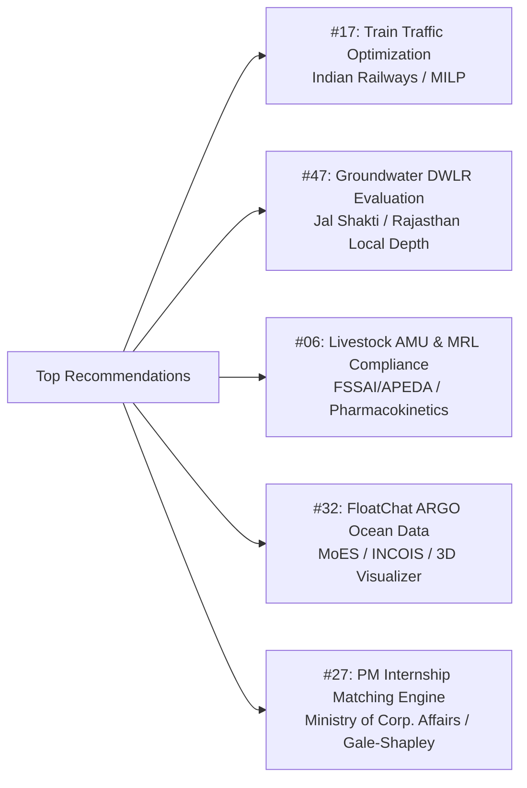

# 🏛️ Internal SIH Playbook (MNIT Jaipur Edition) — v2
### 7-Day Pre-Build Strategy, Problem Selection, Algorithmic Depth & Winning Architecture

---

## 1. The Internal Round Reality: What College Faculty & Judges Look For

Internal university hackathons (like MNIT's internal screening) have a distinct evaluation dynamic compared to the national finale:

```
┌────────────────────────────────────────────────────────────────────────────────────────┐
│                              INTERNAL JURY EVALUATION DYNAMICS                         │
├────────────────────────────────────────────┬───────────────────────────────────────────┤
│ ❌ What Gets Filtered Out (Common Traps)   │ ✅ What Sweeps Top Ranks & Nominations     │
├────────────────────────────────────────────┼───────────────────────────────────────────┤
│ • Generic attendance apps & college ERPs   │ • Rigorous algorithmic / mathematical core│
│ • Kaggle notebook wrapped in Streamlit     │ • Production-grade full-stack architecture│
│ • "Chatbot with prompt engineering"        │ • Domain-specific practitioner visual tool│
│ • Solutions ignoring real Indian datasets  │ • Real government data / Indian DPI links │
│ • Fluffy UI with zero edge-case handling   │ • Live, flawless end-to-end working demo  │
└────────────────────────────────────────────┴───────────────────────────────────────────┘
```

---

## 2. The 10-Minute PS Deep-Dive Protocol

Before committing to any problem statement, spend 10 minutes answering these 5 mandatory questions:

```
┌─────────────────────────────────────────────────────────────────────────────────────────────────┐
│                              THE 10-MINUTE PS DEEP-DIVE TEST                                    │
├───────────────────────────────────┬─────────────────────────────────────────────────────────────┤
│ 1. Specific Algorithm             │ What exact mathematical/computational model solves this     │
│                                   │ (e.g., MILP via PuLP, Kriging, Gale-Shapley, Graph Search)?│
├───────────────────────────────────┼─────────────────────────────────────────────────────────────┤
│ 2. Domain Practitioner's Tool     │ What visual artifact does the actual government officer use │
│                                   │ (e.g., Railway String-Chart, Aquifer 3D Plot, QR Passport)? │
├───────────────────────────────────┼─────────────────────────────────────────────────────────────┤
│ 3. The "Crowd Trap" Floor         │ What will the average student build, and how are we 10x     │
│                                   │ above it?                                                   │
├───────────────────────────────────┼─────────────────────────────────────────────────────────────┤
│ 4. 7-Day Real Data Feasibility    │ Does open public data exist right now (CGWB, INCOIS, OSM)   │
│                                   │ without having to learn heavy specialized biology/physics?  │
├───────────────────────────────────┼─────────────────────────────────────────────────────────────┤
│ 5. Evaluator & Local Resonance    │ Does this resonate personally with the jury (e.g. Rajasthan │
│                                   │ groundwater crisis for MNIT Jaipur professors)?             │
└───────────────────────────────────┴─────────────────────────────────────────────────────────────┘
```

---

## 3. The Anti-Pattern Taxonomy (What to Avoid across all 72 PSs)

| Anti-Pattern Type | Flagged Problem Statements | Why You Must Avoid / The Fatal Flaw |
| :--- | :--- | :--- |
| **The "Attendance / ERP" Trap** | PS 10, 11, 13, 14, 62, 70 | 10+ teams will build basic Face Recognition / QR / Form CRUDs. Zero novelty. |
| **The "Generic Crop Classifier" Trap** | PS 24, 35, 52, 54 | Kaggle dataset + ResNet/YOLO leaf disease scanner. Saturated since 2018. |
| **The "Prompt Wrapper Chatbot" Trap** | PS 38, 45, 61, 71 | Calling an OpenAI/Gemini API with a system prompt. Faculty see through it instantly. |
| **The "Generic Timetable" Trap** | PS 22, 60 | Standard CSP/Genetic Algorithm without deep institutional edge cases. Low visual appeal. |
| **The "High-Barrier Bioinformatics" Trap**| PS 34 | Requires specialized genomics knowledge (k-mers, BLAST, FASTA) that is hard to master in 7 days. |

---

## 4. Top 5 Recommended Problem Statements from MNIT List



### 1. #17 — Maximizing Section Throughput via AI Train Traffic Control
* **Algorithm:** Priority-based Conflict Resolution using **Mixed-Integer Linear Programming (MILP)** with `PuLP` / `OR-Tools` + `NetworkX`.
* **Domain Tool:** Interactive **Time-Distance String Chart** (the actual tool Section Controllers use).
* **Crowd Trap:** Simple schedule table with static Gantt chart.
* **The Winning Feature:** "What-If" Disruption Sandbox (inject a 15-min freight delay or signal failure $\rightarrow$ algorithm reschedules trains live to minimize cascading delay).

### 2. #47 — Real-Time Groundwater Resource Evaluation Using DWLR Data
* **Algorithm:** Spatial Kriging Interpolation (PostGIS) + LSTM / ARIMA 30/90-day time-series depletion forecasting.
* **Domain Tool:** 3D Aquifer Water-Table Isocline Map + District Extraction Quota Advisory.
* **Crowd Trap:** Basic 2D line graph of water level drop.
* **Local Resonance:** Hyper-relevant to Rajasthan’s critical over-exploited water table status.

### 3. #06 — Digital Farm Management for MRL & Antimicrobial Usage (AMU)
* **Algorithm:** **Drug Withdrawal Period (WDP) Pharmacokinetics model** based on veterinary drug half-lives, animal weight, and dosage.
* **Domain Tool:** QR-based Pre-Harvest Compliance Health Passport for export slaughterhouses/dairies + PaddleOCR packaging scanner.
* **Crowd Trap:** Basic medicine inventory log table.

### 4. #32 — FloatChat: AI Interface for ARGO Ocean Data Discovery
* **Algorithm:** Natural Language to Spatio-Temporal Query Engine against NetCDF/JSON public INCOIS ocean datasets + Anomaly Detector (marine heatwaves).
* **Domain Tool:** Interactive Leaflet ocean float trajectories + Plotly 3D salinity/temperature depth profiles.
* **Crowd Trap:** Basic ChatGPT prompt wrapper.

### 5. #27 — AI-Based Smart Allocation Engine for PM Internship Scheme
* **Algorithm:** **Gale-Shapley Stable Matching + Multi-Constraint ILP** (affirmative action, regional quota, industry skill vector).
* **Domain Tool:** Ministry Nodal Officer Policy Simulator + Live Fairness/Bias Audit Dashboard.
* **Crowd Trap:** Basic cosine similarity between resume text and job descriptions.

---

## 5. The 3-Part Mandatory Plan Template (Before ANY Code is Written)

Every project plan must be structured into three mandatory parts to prevent coding agents and team members from dropping specifications:

```
┌────────────────────────────────────────────────────────────────────────────────────────┐
│                              MANDATORY PLAN TEMPLATE STRUCTURE                         │
├────────────────────────────────────────────────────────────────────────────────────────┤
│ PART A: Problem Analysis & Mathematical Formulation                                    │
│ • Core bottleneck & stakeholder personas                                               │
│ • Exact mathematical / algorithmic equations & optimization objective                  │
│ • Data dictionary & PostgreSQL schema (with foreign keys and constraints)              │
├────────────────────────────────────────────────────────────────────────────────────────┤
│ PART B: Structural Contracts & Action Matrix                                           │
│ • UI State Machine (all screen states, enabled/disabled transitions)                   │
│ • PERMITTED_ACTIONS constants (structural allowlist preventing hallucinated buttons)  │
│ • API Contracts (exact request/response JSON schemas for all endpoints)                │
├────────────────────────────────────────────────────────────────────────────────────────┤
│ PART C: Verification & 5-Minute Demo Script                                            │
│ • End-to-end user journey test commands                                                │
│ • Live simulation sandbox script (What parameters to tweak for judges)                 │
│ • Timing breakdown (0:00 to 5:00 min)                                                  │
└────────────────────────────────────────────────────────────────────────────────────────┘
```

---

## 6. The 7-Day Sprint Execution Timeline

```
DAY 1 (Design & Contracts)
├── Run 10-Minute Deep-Dive on selected PS
├── Lock Part A (Math formulation, Postgres schema)
└── Lock Part B (API contracts, PERMITTED_ACTIONS, UI state machine)

DAY 2 (Data Pipeline & Ingestion)
├── Ingest 500-1000 real records into PostgreSQL
└── Verify local query performance and spatial/vector indexes

DAY 3 (Algorithmic / AI Core)
├── Build and unit-test the optimization/ML solver in FastAPI
└── Implement the "What-If" simulation endpoint

DAY 4 (Frontend UI & GIGW Base)
├── Build responsive GIGW dashboard (English/Hindi, high-contrast)
└── Connect UI components directly to API contracts using PERMITTED_ACTIONS

DAY 5 (Interactive Visualizations & Sandbox)
├── Build domain visual tool (String Chart / 3D Isocline / Policy Slider)
└── Connect real-time simulation controls

DAY 6 (Polish, Edge Cases & Deployment)
├── Test edge-case inputs (prevent any hardcoded data failure)
├── Deploy full-stack app to live URL (Render/Vercel/Railway)
└── Record high-resolution offline backup demo video

DAY 7 (Pitch Rehearsal & Slides)
├── Build official 6-slide presentation PDF
└── Rehearse 5-minute pitch with all 6 team members speaking
```
