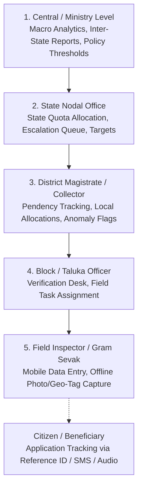
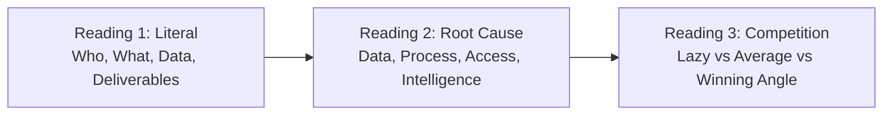
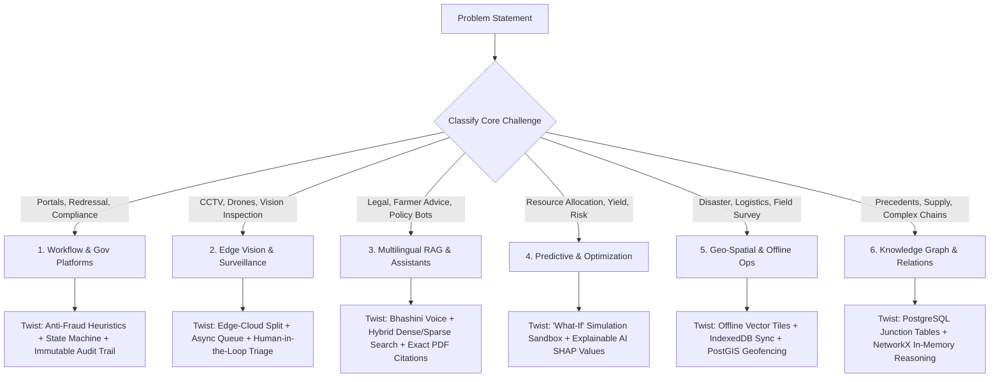
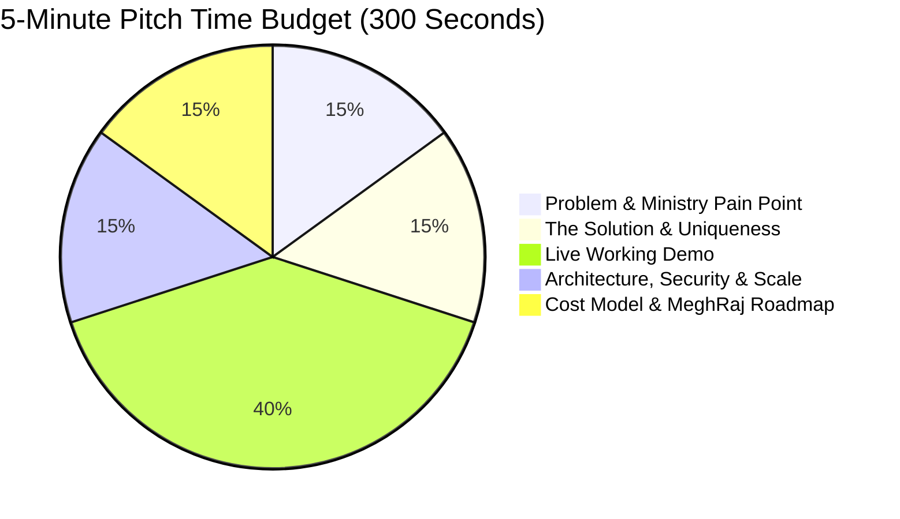

# 🏆 SIH Master Playbook (v4) — The Complete System Design & Decision Operating System

> **Smart India Hackathon (SIH)** is a **government problem-solving exercise** where you prove a solution can be deployed for millions of Indian citizens within real-world constraints. Your team understands architecture, domain logic, and decision trade-offs; AI coding agents write the code. This playbook is your definitive operating system.

---

## 1. What SIH Actually Is

SIH is the world's largest open innovation initiative, organized by the **Ministry of Education's Innovation Cell (MIC)** and **AICTE**. Problem statements are posed directly by **Central Ministries, State Government Departments, Defense/Space agencies (DRDO, ISRO), and Public Sector Undertakings (PSUs - Indian Railways, Coal India, NHAI, ONGC, etc.)**.

Your goal is to build a **deployable, scalable, cost-effective MVP** that a ministry can realistically adopt on government cloud infrastructure (NIC MeghRaj) without crippling license fees.

### The Competition Flow

```
1. Problem Statements published on sih.gov.in
         ↓
2. Your college SPOC registers the institution
         ↓
3. MANDATORY Internal Campus Hackathon (First Hurdle)
   → Evaluated by internal + external jury
         ↓
4. SPOC nominates top teams on SIH portal
   → Uploads official 6-slide PDF presentation per team
         ↓
5. National Pre-Screening by expert ministry jury
   → ~1,300 teams shortlisted from ~50,000+ entries across India
         ↓
6. Grand Finale at assigned Nodal Center (IIT/NIT/IIIT)
   → Software Edition: 36 hours non-stop live development & mentoring
         ↓
7. ₹1,00,000 Cash Prize per winning team per Problem Statement
```

### Team Rules (Non-Negotiable)
- **Exactly 6 members** (no more, no less).
- **At least 1 female member** (mandatory).
- **All 6 from the same institute** (inter-departmental is encouraged).
- **Up to 2 mentors** can accompany the team.
- **Every member must defend their module during Q&A** (judges penalize teams where only the leader speaks).

---

## 2. The Evaluation Rubric: How You Are Scored

$$\text{Final Score} = (\text{Round 1} \times 20\%) + (\text{Round 2} \times 30\%) + (\text{Round 3} \times 50\%)$$

```
┌────────────────────────────────────────────────────────────────────────────────────────┐
│                              THE 3-ROUND EVALUATION MATRIX                             │
├────────────────────────────────────────────────────────────────────────────────────────┤
│ Round 1: Feasibility & Architecture (20%) — ~Hour 8-10                                 │
│ • Problem Understanding (20)    • Solution Appropriateness (20)                        │
│ • Innovation & Novelty (20)     • Technical Feasibility (20)                           │
│ • Impact & Sustainability (20)                                                         │
├────────────────────────────────────────────────────────────────────────────────────────┤
│ Round 2: Working Prototype Progress (30%) — ~Hour 22-24                                │
│ • Prototype Progress (20)       • Technical Soundness (20)                             │
│ • Usability & UX/UI (20)        • Scalability & Security (20)                          │
│ • Teamwork & Mentor Integration (20) [Did you implement Round 1 feedback?]             │
├────────────────────────────────────────────────────────────────────────────────────────┤
│ Round 3: Final Demo & Power Pitch (50%) — ~Hour 32-34                                  │
│ • Completeness & Functionality (20) [Zero hardcoded data — tested with live inputs]   │
│ • Performance & Robustness (20) • User Experience Polish (20)                          │
│ • Deployment Readiness (20)     • Future Scope & Member Defense (20)                   │
└────────────────────────────────────────────────────────────────────────────────────────┘
```

> [!IMPORTANT]
> **Round 3 represents 50% of the entire score.** Judges WILL enter custom edge-case inputs. Any hardcoded data or mock API response is an immediate disqualification.

---

## 3. The 4 Non-Negotiable Pillars of SIH Architecture

```
┌────────────────────────────────────────────────────────────────────────────────────────┐
│ ❌ What Fails (Consumer SaaS Mindset)      │ ✅ What Wins (Public Infrastructure Mindset)│
├────────────────────────────────────────────┼───────────────────────────────────────────┤
│ • Dark mode / neon "crypto" aesthetics     │ • GIGW/WCAG 2.1 accessible, high-contrast │
│ • Expensive proprietary APIs (OpenAI/Google)│ • 100% FOSS / Self-hostable on NIC Cloud │
│ • Assuming continuous high-speed 5G network│ • Offline-first with low-bandwidth sync   │
│ • Flat single "Admin / User" model         │ • 4-tier bureaucratic RBAC hierarchy      │
│ • No audit trails or tamper protection     │ • Immutable state machines & explainability│
└────────────────────────────────────────────┴───────────────────────────────────────────┘
```

### Pillar 1: Multi-Tier Administrative Role Hierarchy (RBAC)
Government departments never operate on a single "Admin" role. Your system must model the real administrative chain of command:



### Pillar 2: Low-Bandwidth & Offline-First Resilience
In rural districts, remote blocks, or disaster areas, internet is spotty.
1. **Service Workers + Cache Storage:** Cache UI schemas, static assets, and form templates on first load.
2. **Client-Side Queue:** Use **IndexedDB** (web) or **SQLite** (mobile) to store submissions locally with `SYNC_PENDING` status.
3. **Idempotent Background Sync:** On reconnection, flush payloads with `UUIDv4` idempotency keys to prevent duplicate transactions.
4. **Payload Optimization:** Send WebP compressed images ($<100\text{ KB}$) and delta JSON updates instead of bloated payloads.

### Pillar 3: GIGW & WCAG 2.1 Compliance (Effectiveness over Eye-Candy)
* **Bilingual Toggle:** English + Hindi (plus relevant regional language) prominent at header.
* **Accessibility Features:** Text scaling ($A-$, $A$, $A+$), high-contrast toggle, keyboard navigation, and semantic HTML (`<main>`, `<nav>`, `<article>`, `aria-labels`).
* **High-Density Data Tables:** Sortable, filterable by District/Status/Date with CSV/PDF export.
* **Breadcrumb Navigation:** `Home > Ministry > Department > Scheme > Application #10429`.

### Pillar 4: FOSS & NIC MeghRaj Cloud Viability
Judges heavily penalize solutions requiring expensive commercial subscriptions ($0.05 per API call) at 1.4 billion citizen scale.
* **Open Source Foundations:** Use Ollama, Mistral, LLaMA-3, Whisper, PaddleOCR, Tesseract.
* **Geo-Spatial:** MapLibre GL, OpenStreetMap, or ISRO Bhuvan integration over paid Google Maps.
* **Unified Database:** Standardize on **PostgreSQL** with extensions:
  * `PostGIS` $\rightarrow$ Spatial queries & geofencing.
  * `pgvector` $\rightarrow$ Vector embeddings & similarity search.
  * `JSONB` $\rightarrow$ Unstructured form metadata.
  * `TSVector` $\rightarrow$ Full-text keyword search.

---

## 4. Problem Dissection: The 3-Reading Method

Before choosing an architecture or writing any code, run the Problem Statement (PS) through three systematic readings in the first 2 hours:



1. **Reading 1 — Literal:**
   * Who is the exact end-user? (Citizen, District Officer, Field Inspector, Ministry Secretary)
   * What is the core pain point in **one sentence**?
   * What data formats are involved? (PDFs, satellite raster, CCTV RTSP stream, tabular CSV)
   * What are the explicit deliverables mentioned in the PS?

2. **Reading 2 — Root Cause Analysis:**
   * *Data problem?* (Unstructured, scattered across departments, un-indexed)
   * *Process problem?* (Manual paper delay, lack of SLA enforcement, file tracking bottleneck)
   * *Access problem?* (Language barrier, digital illiteracy, weak rural connectivity)
   * *Intelligence problem?* (Fraudulent claims, allocation inefficiency, failure to detect patterns)
   * *Infrastructure problem?* (Legacy databases, disconnected legacy silos)
   * *(If 3+ apply, you have a Compound Problem requiring a hybrid architecture).*

3. **Reading 3 — Competition & Differentiation:**
   * What is the **lazy solution**? (Generic CRUD form + default dashboard)
   * What is the **average solution**? (Calling closed OpenAI API with basic prompt)
   * What is the **winning solution**? (Retrofit existing infrastructure + offline capability + explainable automated verification)

---

## 5. The 6 Problem Archetypes & Canonical Architectures



### The Hybrid Rule
> **Every SIH winning solution combines 2–3 archetypes.** A standalone CRUD app or an isolated ML model never wins.

### Tech Stack Arbitration for Hybrids
> **The heaviest AI/ML/Data component dictates the primary backend language.** (If RAG, CV, or ML is involved $\rightarrow$ **Python / FastAPI**).

---

### Archetype 1: Workflow, Governance & Public Portals (CRUD++)
* **Typical Problems:** Grievance redressal, subsidy distribution, vendor verification, scheme compliance.
* **Hackathon Tech:** FastAPI + PostgreSQL + React (PWA) + Tailwind/Vanilla CSS.
* **Production Tech Diagram:** Microservices behind NGINX + PostgreSQL Cluster + Redis Cache + OAuth2/eKYC.
* **The Winning Twist:** 
  1. Automated Anti-Fraud / Verification engine (OCR document verification + perceptual hashing for duplicate detection).
  2. Strict State Machine (`Draft` $\rightarrow$ `Submitted` $\rightarrow$ `Under Verification` $\rightarrow$ `Approved` $\rightarrow$ `Disbursed`).
  3. Immutable append-only audit trail logging every user, timestamp, and action for RTI compliance.

---

### Archetype 2: Edge Intelligence & Computer Vision
* **Typical Problems:** Pothole/road defect detection, railway track fault analysis, crowd safety, illegal mining via drones.
* **Hackathon Tech:** OpenCV + YOLOv8/ONNX Runtime + FastAPI + Celery/Background Worker.
* **Production Tech Diagram:** Edge Jetson/Gateway nodes running TensorRT $\rightarrow$ MQTT $\rightarrow$ Cloud Aggregator.
* **The Winning Twist:**
  1. **Edge-Cloud Split:** Process video locally; transmit only low-res anomaly crops + JSON telemetry to the cloud.
  2. **Confidence-Based Triage:** $>85\%$ auto-approves work tickets; $<85\%$ routes to officer manual review queue.
  3. **Temporal & Spatial Aggregation:** Convert point detections into actionable heatmaps over time.

---

### Archetype 3: Multilingual Citizen RAG & Policy Assistants
* **Typical Problems:** Legal research assistant, farmer advisory, citizen scheme discovery.
* **Hackathon Tech:** LangChain/LangGraph + ChromaDB / PostgreSQL `pgvector` + Ollama/Mistral + FastAPI.
* **Production Tech Diagram:** Qdrant Vector DB + vLLM Cluster + Bhashini Speech Pipeline + Redis Semantic Cache.
* **The Winning Twist:**
  1. **Bhashini Speech Integration:** Voice-in, voice-out in Hindi and regional dialects.
  2. **Hybrid Retrieval:** Dense Semantic Vector Search + Sparse BM25 Keyword Search.
  3. **Zero-Hallucination Citations:** Exact highlighted PDF document page citations with clickable reference links.

---

### Archetype 4: Predictive Analytics, Optimization & Forecasting
* **Typical Problems:** Railway freight rake scheduling, agricultural crop price forecasting, hospital bed allocation.
* **Hackathon Tech:** Scikit-learn / LightGBM / PuLP Optimization + FastAPI + Plotly/Recharts.
* **Production Tech Diagram:** MLflow + Ray Cluster + PostgreSQL + Kafka Feature Stream.
* **The Winning Twist:**
  1. **"What-If" Simulation Sandbox:** Interactive sliders letting officers test policy levers (*"What if rainfall drops 20%?"*).
  2. **Explainable AI (XAI):** Real-time SHAP feature importance charts showing *why* a decision was recommended.

---

### Archetype 5: Geo-Spatial, Field Operations & Disaster Response
* **Typical Problems:** Flood rescue dispatch, forest patrol tracking, border surveillance.
* **Hackathon Tech:** MapLibre GL / Leaflet + PostGIS + IndexedDB offline sync + FastAPI.
* **Production Tech Diagram:** GeoServer + PostGIS Cluster + ISRO Bhuvan API + MQTT GPS ingestion.
* **The Winning Twist:**
  1. **Offline Vector Tiles:** Cached base maps rendering without active internet.
  2. **SMS / Coordinate Fallback:** Low-bandwidth data sync when mobile internet fails.
  3. **PostGIS Geofencing:** Automated boundary breach and hazard containment alerts.

---

### Archetype 6: Knowledge Graph & Entity Relationships
* **Typical Problems:** Precedent legal citation networks, supply chain dependency analysis, crime syndicate tracking.
* **Hackathon Tech:** PostgreSQL (Relational tables with junction tables) + Python `NetworkX` + FastAPI.
* **Production Tech Diagram:** Neo4j Enterprise Cluster + Graph Data Science (GDS) + PostgreSQL.
* **The Winning Twist:** Reasoning chains across 3+ hops of relationships (e.g., *Case A cites Case B which overruled Case C*).

```sql
-- Model Graph Relationships cleanly in PostgreSQL for Hackathons:
CREATE TABLE entities (
    id SERIAL PRIMARY KEY,
    name TEXT NOT NULL,
    entity_type TEXT NOT NULL,
    metadata JSONB
);

CREATE TABLE entity_relationships (
    source_id INT REFERENCES entities(id),
    target_id INT REFERENCES entities(id),
    relationship_type TEXT NOT NULL, -- e.g., 'CITES', 'SUPPLIES', 'REPORTS_TO'
    weight FLOAT DEFAULT 1.0,
    created_at TIMESTAMP DEFAULT CURRENT_TIMESTAMP,
    PRIMARY KEY (source_id, target_id, relationship_type)
);
```

```python
# In-Memory Graph Reasoning via NetworkX:
import networkx as nx

G = nx.DiGraph()
for edge in db_edges:
    G.add_edge(edge.source_id, edge.target_id, rel=edge.relationship_type)

# Calculate centrality & find shortest path
pagerank = nx.pagerank(G)
path = nx.shortest_path(G, source=entity_1, target=entity_2)
```

---

## 6. AI Coding Agent Compatibility: The Agent-Friendly Stack

> **The Golden Rule:** Never use a technology in hackathon code that your AI coding agent cannot reliably write, debug, and modify at 3 AM. Show enterprise tech in your architecture diagram; use clean equivalents in code.

| Technology | AI Agent Proficiency | Hackathon Choice | Production Diagram Equivalent |
| :--- | :--- | :--- | :--- |
| **Relational Data** | 🟢 Excellent (~98% accuracy) | PostgreSQL / SQLite | PostgreSQL Cluster with Read Replicas |
| **Backend API** | 🟢 Excellent | Python FastAPI | FastAPI / Go Microservices |
| **Frontend UI** | 🟢 Excellent | React / Next.js (Tailwind/CSS) | React PWA on CDN Edge |
| **Vector Search** | 🟢 High | ChromaDB / `pgvector` | Managed Qdrant / Pinecone |
| **Graph Logic** | 🟢 Excellent | PostgreSQL + NetworkX | Neo4j + Graph Data Science |
| **Async Queues** | 🟡 Moderate | Python `asyncio` / BackgroundTasks | RabbitMQ / Apache Kafka |
| **Caching** | 🟢 Simple | In-Memory Dict / SQLite Cache | Redis Cluster |

---

## 7. Distributed Team Coordination Protocol

When 6 members build simultaneously across frontend, backend, ML, and slides, **contracts between components are more critical than the code itself.**

```
LAYER 1: UI STATE MACHINE       → Valid screen states, transitions, disabled buttons
LAYER 2: UI ACTION MATRIX       → Every button ID → API endpoint → Payload → Response
LAYER 3: API CONTRACTS (JSON)   → Exact request/response shapes (Pydantic / TypeScript)
LAYER 4: DATA DICTIONARY        → SQL table schemas, column types, foreign keys
LAYER 5: STRUCTURAL ALLOWLIST   → PERMITTED_ACTIONS constants preventing AI agent drift
```

### The Structural UI Action Allowlist (Preventing Agent Hallucinations)

```javascript
// src/constants/PERMITTED_ACTIONS.js
export const PERMITTED_ACTIONS = {
  "btn-submit-verification": {
    label: "Verify & Approve Document",
    endpoint: "POST /api/v1/applications/verify",
    allowedRoles: ["DISTRICT_OFFICER", "STATE_ADMIN"]
  },
  "btn-sync-offline": {
    label: "Sync Pending Data",
    endpoint: "POST /api/v1/sync/batch",
    allowedRoles: ["FIELD_INSPECTOR"]
  }
};
```

### The Change Propagation Protocol (When Mentors Request Live Changes)
1. **Architect updates contracts first (10 min):** Update the API contract JSON and UI Action Matrix.
2. **Share updated contract with team (2 min):** *"New field `tribunal_id` added to `POST /api/v1/cases`"*.
3. **Parallel implementation (30–60 min):** Backend adds route; Frontend adds UI component; ML updates inference.
4. **Integration Test (15 min):** End-to-end verification.
5. *Rule: Nobody writes code before the contract is updated.*

---

## 8. Indian Digital Public Infrastructure (DPI) Integration Matrix

Mentioning and integrating Indian DPI creates immediate alignment with ministry evaluators:

| DPI Platform | Core Functionality | Best Use Cases in SIH |
| :--- | :--- | :--- |
| **Bhashini** | Voice recognition, translation, TTS in 22 languages | Citizen portals, farmer advisory, grievance hotlines |
| **DigiLocker** | Verifiable digital document fetching via URI | Student verification, land records, vehicle registrations |
| **Aadhaar eKYC** | Paperless identity verification | Direct benefit transfers (DBT), citizen authentication |
| **ISRO Bhuvan** | Indian satellite imagery and GIS layers | Agriculture, disaster management, mining surveillance |
| **PM Gati Shakti** | Multi-modal infrastructure GIS platform | Logistics, road planning, railway routing |
| **data.gov.in** | Open Indian government datasets | Predictive models, price forecasting, public health |
| **UMANG** | Unified mobile application for multi-service access | Inter-departmental citizen services |

---

## 9. The 36-Hour Hackathon Survival Timeline

```
DAY 1
━━━━━━━━━━━━━━━━━━━━━━━━━━━━━━━━━━━━━━━━━━━━━━━━━━━━━━━━━━━━━━━━━━━━━
09:00 - 11:30 │ Setup, Wi-Fi configuration, run pre-built baseline code
11:30 - 14:00 │ Hour 0-2.5: Verify baseline APIs, assign 36-hour sprint modules
14:00 - 18:00 │ Hour 3.5-6.5: Polish core workflow, verify cloud deployment
18:00 - 19:30 │ 🔵 MENTORING ROUND 1 — Listen deeply. Take verbatim notes.
19:30 - 21:00 │ SPRINT 1: Implement mentor-suggested features immediately
21:00 - 23:00 │ 🔴 ROUND 1 EVALUATION (20%) — Architecture & Feasibility pitch

NIGHT STRETCH
━━━━━━━━━━━━━━━━━━━━━━━━━━━━━━━━━━━━━━━━━━━━━━━━━━━━━━━━━━━━━━━━━━━━━
23:00 - 04:00 │ SPRINT 2: Edge cases, error boundaries, live DB queries, XAI
04:00 - 05:00 │ Team power nap / energy break
05:00 - 08:00 │ SPRINT 3: GIGW styling polish, bilingual toggle, high-contrast

DAY 2
━━━━━━━━━━━━━━━━━━━━━━━━━━━━━━━━━━━━━━━━━━━━━━━━━━━━━━━━━━━━━━━━━━━━━
09:00 - 10:30 │ 🔵 MENTORING ROUND 2 — Final validation of feedback implementation
10:30 - 13:00 │ 🔴 ROUND 2 EVALUATION (30%) — Full Working Prototype Demo
14:00 - 17:00 │ Bug freezes, deploy to live URL, RECORD BACKUP DEMO VIDEO
17:00 - 18:00 │ Team pitch rehearsal (every member speaks for 45 seconds)
18:00 - 21:00 │ 🔴 ROUND 3 FINAL JURY EVALUATION (50%) — 5-minute power pitch
21:00 - 23:30 │ Results & Award Ceremony
```

---

## 10. The 5-Minute Final Pitch Structure



1. **0:00 – 0:45 | Problem & Ministry Reality:** State the core bottleneck, who loses time/money, and why existing solutions fail.
2. **0:45 – 1:30 | The Unique Solution:** Present your 2 core differentiators (e.g., automated fraud detection, offline voice workflow).
3. **1:30 – 3:30 | Live End-to-End Demo:**
   * Step 1: Citizen / Field data entry (offline / regional voice).
   * Step 2: Automated backend state machine transition + AI validation.
   * Step 3: District / Ministry analytical dashboard with audit log.
4. **3:30 – 4:15 | Architecture, Security & Scale:** Show the system diagram, RBAC hierarchy, PostgreSQL/PostGIS foundation, and modular pluggability.
5. **4:15 – 5:00 | Cost, MeghRaj Cloud & Impact:** Emphasize 100% FOSS tech stack (zero license overhead to the public exchequer) and quantified pilot rollout impact.

---

## 11. Pre-Hackathon & Pre-Build Checklist

- [ ] **Data Pipeline:** 500–2,000 clean records pre-populated in PostgreSQL.
- [ ] **Vector Embeddings:** Pre-computed and indexed in ChromaDB / `pgvector`.
- [ ] **Pre-Trained / Quantized Models:** ONNX / YOLO weights trained and stored locally (venue Wi-Fi will be slow).
- [ ] **Backend Skeleton:** FastAPI routes, Pydantic schemas, and SQLAlchemy ORM models configured.
- [ ] **Frontend Kit:** GIGW-compliant base layout, bilingual language context, and high-contrast toggle ready.
- [ ] **Deployment Staging:** Live cloud URL running on Render / Railway / Vercel / Cloudflare with custom domain backup.
- [ ] **Offline Backup Demo Video:** High-resolution screen recording of the complete working flow saved locally.
- [ ] **Team Defense:** Every single member can explain their module and the system data flow without hesitating.
